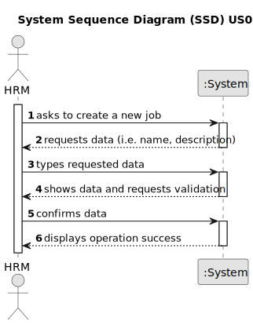

# US002 - Register a job 

## 1. Requirements Engineering

### 1.1. User Story Description

As an HRM, I want to register a job that a collaborator need to have.

### 1.2. Customer Specifications and Clarifications 

**From the specifications document:**

>Transcribed:	_An employee has a main ocupation (job) and set off skills that enable him to perform certain tasks._
>
> Justification: An employee is given a position upon hiring, which HRM needs to register.

**From the client clarifications:**

> **Question:** (09/03/2024) What parameters should we receive?
>
> **Answer:** The job name. For example: gardener, electrician, designer, estimator, vehicle driver.

> **Question:** (09/03/2024) The job needs a description?
>
> **Answer:** It could be interesting because of the distance between the people who manage documentation and systems and between the people who are in the field, these types of descriptions facilitate the secretarial work.

> **Question:** (16/03/2024) Which other acceptance criteria can we consider? Using only characters?
>
> **Answer:** No digits, no special characters like hashtags or exclamation points. Can have spaces or dashes but nothing else.

### 1.3. Acceptance Criteria

* **AC1:** All required fields must be filled in.
* **AC2:** The field name can only have letters, no digits, no special characters like hashtags or exclamation points. Can have spaces or dashes but nothing else.
* **AC3:** It is necessary to validate the data entered for the job to make sure it is correct.
* **AC4:** It shouldn't allow duplicated jobs (e.g. avoid the same job starting with or without capital letter).

### 1.4. Found out Dependencies

* Should have jobs to register.

### 1.5 Input and Output Data

**Input Data:**

* Typed data:
    * a job
    * a description 
    
	
**Output Data:**

* (In)Success of the operation

### 1.6. System Sequence Diagram (SSD)

### 1.7 Other Relevant Remarks

