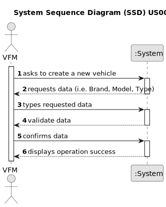

# US006 - As an FM, I wish to register a vehicle

## 1. Requirements Engineering

### 1.1. User Story Description

As a Fleet Manager (FM), I wish to register a vehicle

### 1.2. Customer Specifications and Clarifications 

**From the specifications document:**

> Transcribed: _Vehicles are needed to carry out the tasks assigned to the teams as well as to transport
machines and equipment. This type of vehicle can be only for passengers or mixed,
light or heavy, open box or closed vans or trucks._
>
> Justification: Clarifies what types of vehicles exists on this context.

[//]: # (**From the client clarifications:**)

[//]: # ()
[//]: # (> **Question:** )

[//]: # (>)

[//]: # (> **Answer:** )

### 1.3. Acceptance Criteria

* **AC1:** The system must validate the vehicle's unique identification.
* **AC2:** Should be possible register the operational status of the vehicle(Active, On maintenance, Inactive, etc.).

### 1.5 Input and Output Data

**Input Data:**

* Typed data:
    * a Brand
    * the Model
    * a Type
    * the Tare
    * the GrossWeight
    * the Current Km
    * the Register Date
    * the Acquisition Date
    * a Maintenance/Checkup Frequency (in Kms).
	
* Selected data:
  * a Brand
  * the Model
  * a Type

**Output Data:**

* (In)Success of the operation

### 1.6. System Sequence Diagram (SSD)

[//]: # (**_Other alternatives might exist._**)

[//]: # (#### Alternative Two)

[//]: # ()
[//]: # (![System Sequence Diagram - Alternative Two]&#40;svg/us006-system-sequence-diagram-alternative-two.svg&#41;)

