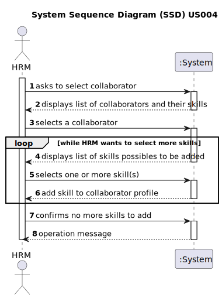

# US004 - Assign one or more skills to a collaborator

## 1. Requirements Engineering

### 1.1. User Story Description

As an HRM, I want to assign one or more skills to a collaborator.

### 1.2. Customer Specifications and Clarifications 
**From the specifications document:**

> Transcribed: _A collaborator is a person who is an employee of the organization and carries out
design, construction and/or maintenance tasks for green areas, depending on their
skills._
> 
> Justification: Provides clarity on the role and responsibilities of a collaborator within the organization, emphasizing their involvement in tasks related to green spaces.

> Transcribed: _Skill is a characteristic that enable the collaborator to perform/take on certain tasks/responsibilities._
> 
> Justification: Defines skills as essential attributes that empower collaborators to perform specific tasks effectively, contributing to their versatility and efficiency within the organization, and are not job's specific.

> Transcribed: _Tasks are carried out on an occasional or regular basis in one or more green spaces, for example: tree pruning; installation of an irrigation system; installation of a lighting system._
> 
> Justification: Identifies specific tasks performed in green spaces, aiding managers in resource allocation and productivity optimization.

**From the client clarifications**
> Question: Can more skills be added to  a collaborator throughout the time? (9th March 2024)
> 
> Answer: Yes

> Question: Is there a minimum or maximum  of skills that can be added to a collaborator's profile? (9th March 2024)
> 
> Answer: No.

> Question: Do jobs have specific skills? (9th March 2024)
>
> Answer: No. A gardener can drive vehicles.

> Question: Is there any special characteristic that the collaborator needs to have in order for these skills to be added to him? (13th March 2024)
>
> Answer: No.

> Question: Is there any certification/proof needed to register a skill to a colaborator? (15th March 2024)
>
> Answer: No.

> Question: Can a collaborator have no skills assigned? (27th March 2024)
>
> Answer: Yes.

### 1.3. Acceptance Criteria
* **AC1:** Collaborator must be registered in the system.
* **AC2:** Skills must be predefined in the system.
* **AC3:** Collaborator can have no skill added.
* **AC4:** One or more skills can be selected from the list for each collaborator.

### 1.4. Found out Dependencies

There are dependency on "US01 - Register skills that a collaborator may have" and "US03 - Register a collaborator with a job and fundamental
characteristics" as there must be predefined skills in the system and registered collaborators.

### 1.5 Input and Output Data
**Input Data:**

* Selected data
  * Selection of collaborator from the registered ones.
  * Selection of one or more skills from a predefined list.

**Output Data:**

* (In)Successul assignment of skill(s) to collaborator

### 1.6. System Sequence Diagram (SSD)

### 1.7 Other Relevant Remarks

The Human Resources management system should have functionality to manage skills: adding, updating, and removing.

