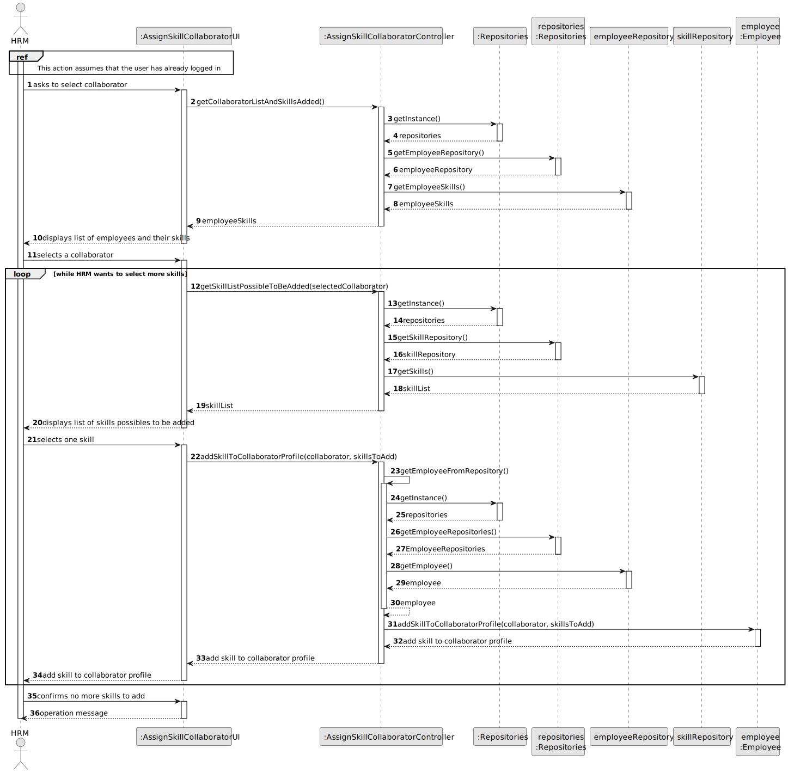
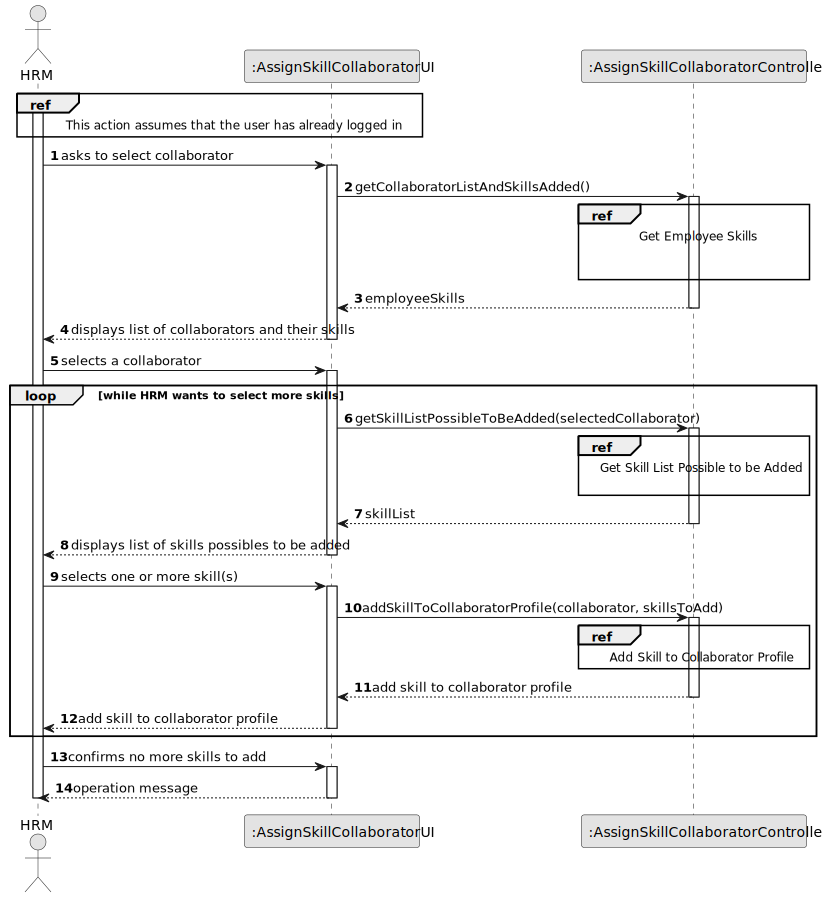
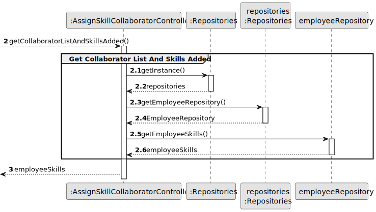
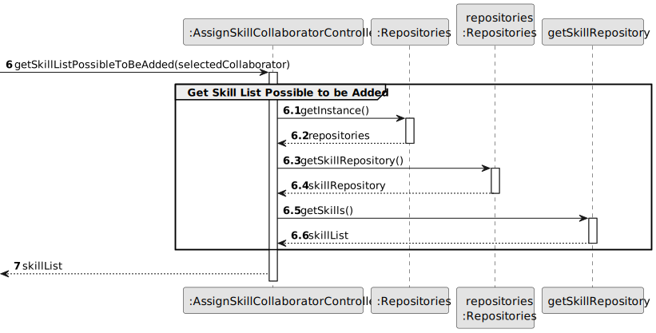
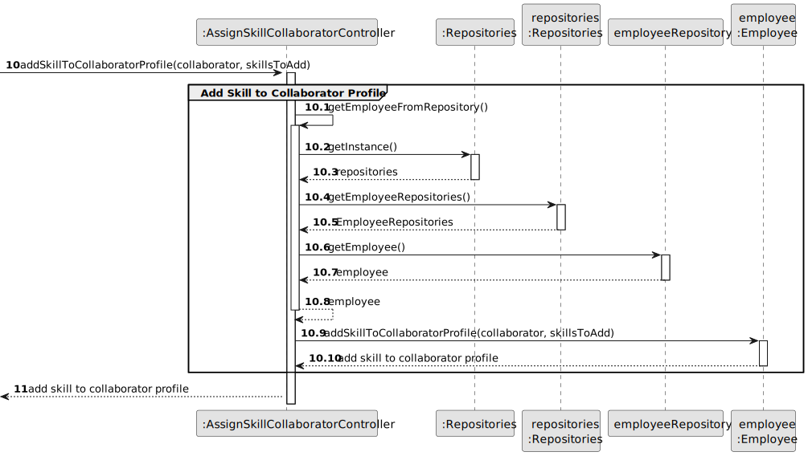
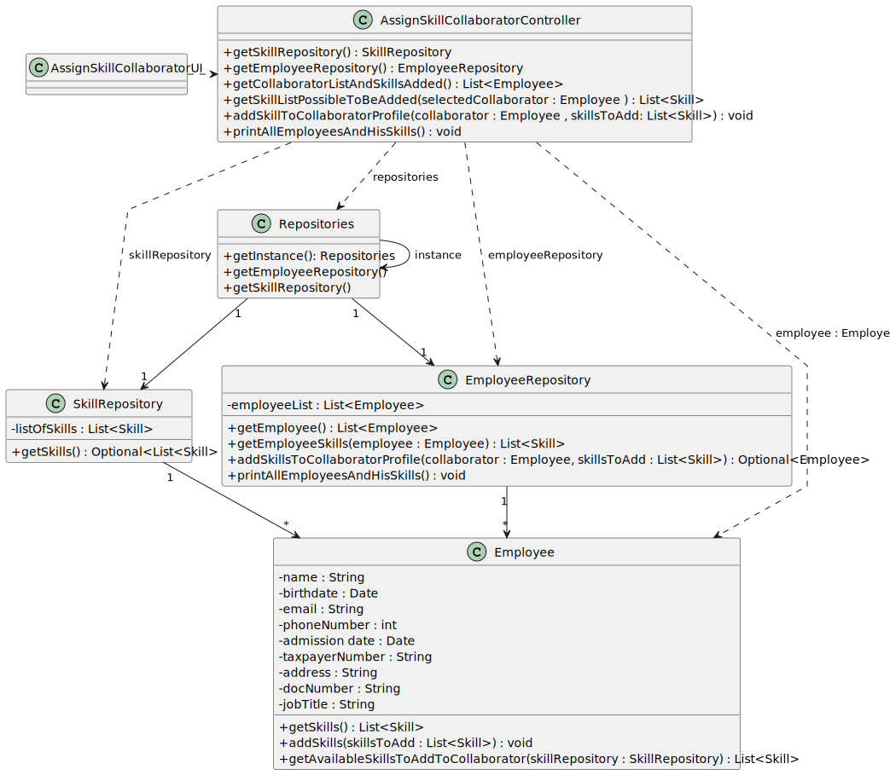

# US004 - Assign one or more skills to a collaborator

## 3. Design - User Story Realization 

### 3.1. Rationale

| Interaction ID | Question: Which class is responsible for...                                                                | Answer                            | Justification (with patterns)                                                                                 |
|:---------------|:-----------------------------------------------------------------------------------------------------------|:----------------------------------|:--------------------------------------------------------------------------------------------------------------|
| Step 1 	       | 	... interacting with the actor?                                                                           | AssignSkillCollaboratorUI         | Pure Fabrication: there is no reason to assign this responsibility to any existing class in the Domain Model. |
| 			  		        | 	... coordinating the US?                                                                                  | AssignSkillCollaboratorController | Controller                                                                                                    |
| 			  		        | 	... displays list of collaborators and associated skills?                                                 | EmployeeRepository |  Pure Fabrication, I.E.: has all collaborators registered and skills associated                                                                                                    |
| Step 2 		      | 					                                                                                                      |               |                            |
| Step 3         | 	...validating the selected data?                                                                          | AssignSkillCollaboratorUI         | Pure Fabrication                                                                                              |
|                | 	...temporarily keeping the selected collaborator and their previous skill(s)?                             | AssignSkillCollaboratorUI         | Pure Fabrication                                                                                              |
|                | 	... showing skill(s) possibles to be added to the collaborator, depending on the skills previously added? | SkillRepository                   | Pure Fabrication IE: has all skills previously registered in the system                                       |
| Step 4 		      | 					                                                                                                      |               |                            |
| Step 5 		      | 	... validating the selected skill?                                                                        | AssignSkillCollaboratorUI         | Pure Fabrication                                                                                              |
|                | 	... temporarily keeping the selected skill?                                                               | AssignSkillCollaboratorUI         | Pure Fabrication                                                                                              |
| 	  		          | ... knowing the user using the system?                                                                     | EmployeeRepository             | IE: knows/has HRM.                                                                                            |
| 			  		        | 		... displaying information about new skill added to collaborator's profile?				                          | AssignSkillCollaboratorUI         | Pure Fabrication                                                                                              |
| 		             | 	... saving new skill(s) to collaborator's profile?                                                        | Employee                          | IE: object created has its own data                                                                           | 
| 			  		        | 	... validating all data (global validation)?                                                              | Employee                          | 	IE: owns all its Collaborators                                                                               | 
| Step 6	        | 					                                                                                                      |               |                            |
| 			 Step 7 		  | 	     ... confirming end of adding?                                                                        |        AssignSkillCollaboratorUI                 | 	     Pure Fabrication                                                                          |
| Step 8		       | 	... informing operation success?                                                                          | AssignSkillCollaboratorUI         | 	Pure Fabrication                                                                                             | 

### Systematization ##

According to the taken rationale, the conceptual classes promoted to software classes are: 

* Employee

Other software classes (i.e. Pure Fabrication) identified: 

* AssignSkillCollaboratorUI
* AssignSkillCollaboratorController
* EmployeeRepository
* SkillRepository

## 3.2. Sequence Diagram (SD)

### Full Diagram

This diagram shows the full sequence of interactions between the classes involved in the realization of this user story.

### Split Diagrams

The following diagram shows the same sequence of interactions between the classes involved in the realization of this user story, but it is split in partial diagrams to better illustrate the interactions between the classes.

It uses Interaction Occurrence (a.k.a. Interaction Use).

**Get Collaborator List and Skills Added Partial SD**

**Get Skill List Possible to be Added Partial SD**

**Add Skill to Collaborator Profile Partial SD**

## 3.3. Class Diagram (CD)

