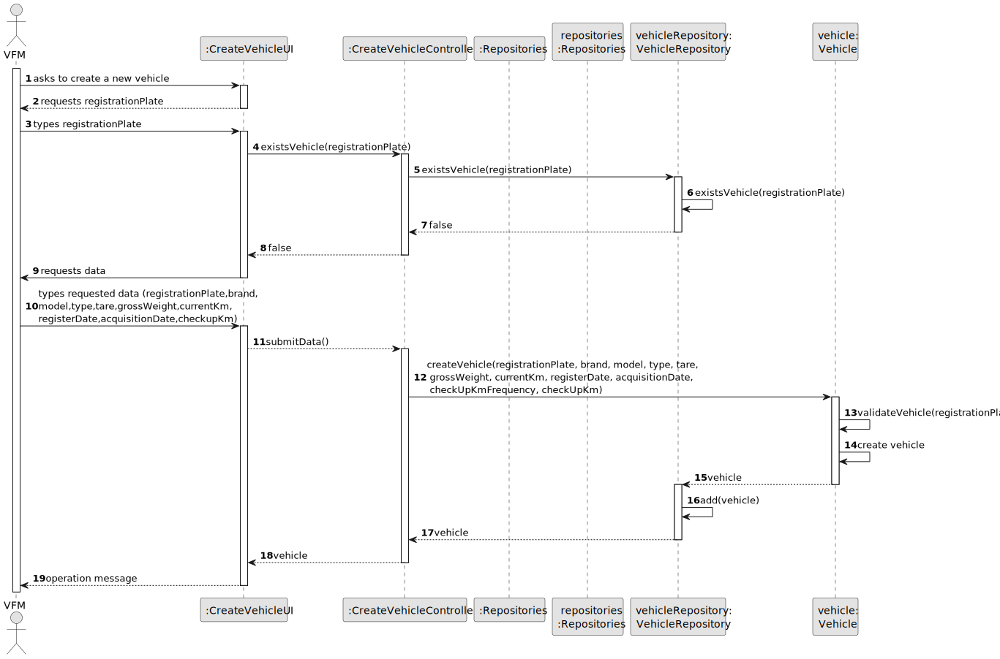
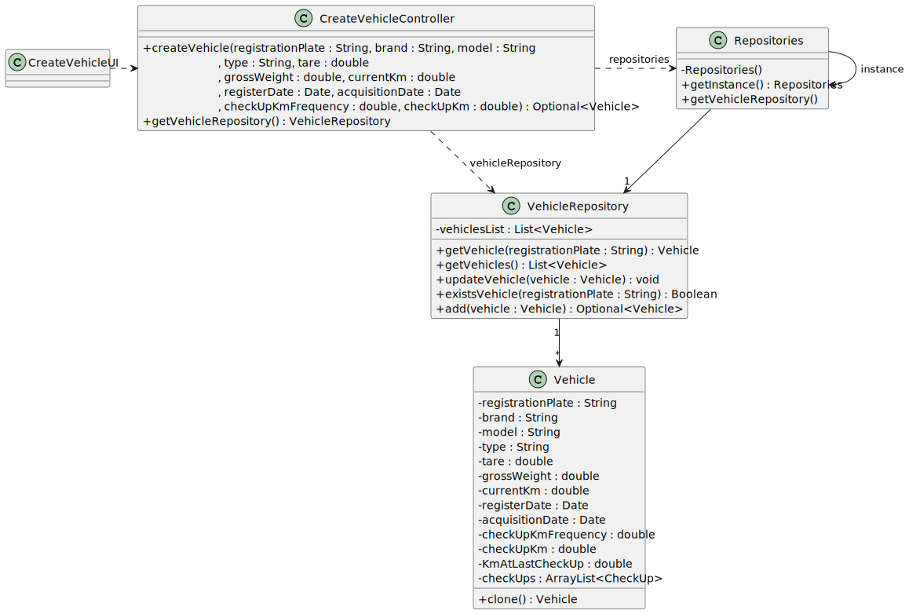

#  US006 - Create a Vehicle 

## 3. Design - User Story Realization 

### 3.1. Rationale

| Interaction ID | Question: Which class is responsible for...                 | Answer                  | Justification (with patterns)                                                                                 |
|:---------------|:------------------------------------------------------------|:------------------------|:--------------------------------------------------------------------------------------------------------------|
| Step 1  		     | 	... interacting with the actor?                            | CreateVehicleUI         | Pure Fabrication: there is no reason to assign this responsibility to any existing class in the Domain Model. |
| 			  		        | 	... coordinating the US?                                   | CreateVehicleController | Controller                                                                                                    |
| 			  		        | 	... instantiating a new Vehicle?                           | Vehicle                 | Creator (Rule 1): in the DM Organization has a Task.                                                          |
| 		             | 			...requesting registration plate?				                    | CreateVehicleUI         | Pure Fabrication                                                                                              |
| Step 2  		     | 						                                                      |          |                                                                                              |
| Step 3  		     | 	... validating registration plate?                         | VehicleRepository       | IE: knows all its Vehicles instances                                                                                               |
| 	              | ...temporarily keeping requested data?                      | CreateVehicleUI         | Pure Fabrication                                                                                              |
| 	              | ... validating all data (local validation)?                 | VehicleRepository       | IE: knows all its Vehicles instances                                                                          |
| 		             | 	...requesting data?                                        | CreateVehicleUI         | 	Pure Fabrication                                                                                             |
| Step 4 		      | 						                                                      |          |                                                                                              |
| Step 5  		     | 	... typing requested data?                                 | CreateVehicleUI         | Pure Fabrication                                                                                              |
| 	              | 	...temporarily keeping requested data?                     | CreateVehicleUI         | Pure Fabrication                                                                                              |
| 	              | 	... creating Vehicle Object?                               | Vehicle                 | Creator                                                                                                       |
| 		             | 	... validating all data (local validation)?                | Vehicle                 | IE: object created has its own data                                                                           |
| 		             | 	... validating all data (global validation)?               | Vehicle                 | 	IE: knows all its Vehicles instances                                                                         |
| 		             | 	... saving inputted data?                                  | VehicleRepository       | IE: object created has its own data                                                                           |
| Step 6 		      | 	... informing operation success?                           | CreateVehicleUI         | Pure Fabrication                                                                                              | 

### Systematization ##

According to the taken rationale, the conceptual classes promoted to software classes are: 

* Vehicle

Other software classes (i.e. Pure Fabrication) identified: 

* CreateVehicleUI  
* CreateVehicleController
* VehicleRepository

## 3.2. Sequence Diagram (SD)

_**Note that SSD - Alternative Two is adopted.**_

### Full Diagram

This diagram shows the full sequence of interactions between the classes involved in the realization of this user story.

## 3.3. Class Diagram (CD)

