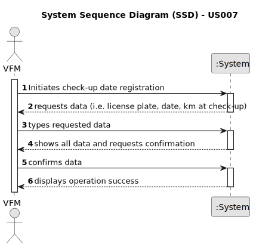

# US007 - Register a vehicle’s check-up

## 1. Requirements Engineering

### 1.1. User Story Description

As a Vehicle and Equipment Fleet Manager, I wish to register a vehicle’s check-up.

### 1.2. Customer Specifications and Clarifications 

**From the specifications document:**

> Transcribed: Vehicles are needed to carry out the tasks assigned to the teams as well as to transport
machines and equipment.
> 
> Justification: When running a large fleet, it's fundamental that vehicle maintenance are kept up to date, in order to increase the efficiency of operations. The fleet manager needs to register when vehicles do the mandatory check-ups, in order to keep track of the fleet maintenance schedule.

**From the client clarifications:**

 
> **Question:** How frequent should the vehicles kilometers be updated (08/03/2024)?
>
> **Answer:** Vehicles kilometers bust be updated weekly by the Fleet Manager or by the instituion employees.

> **Question:** What happens after the vehicle check-up (08/03/2024)?
>
> **Answer:** The system needs to zero the kilometers of the car until new check-up.

> **Question:** Which are the acceptance criteria (17/03/2024)?
>
> **Answer:** vehicle plate number, date, km at checkup.

### 1.3. Acceptance Criteria

* **AC1:** All required fields must follow the correct format.
* **AC2:** All data fields must be filled in (vehicle plate number, date and kilometers at check-up).
* **AC3:** The system must acknowledge the check-up registration and reset the vehicle's kilometer count for the next check-up.

### 1.4. Found out Dependencies

* There is a dependency on "US06 - "Register a vehicle" as there must be a vehicle already registered in the system.

### 1.5 Input and Output Data

**Input Data:**

* Typed data:
  * check-up date (DD/MM/YYYY)
  * km
	
* Selected data:
    * vehicle

**Output Data:**

* Success of the operation

### 1.6. System Sequence Diagram (SSD)

### 1.7 Other Relevant Remarks

