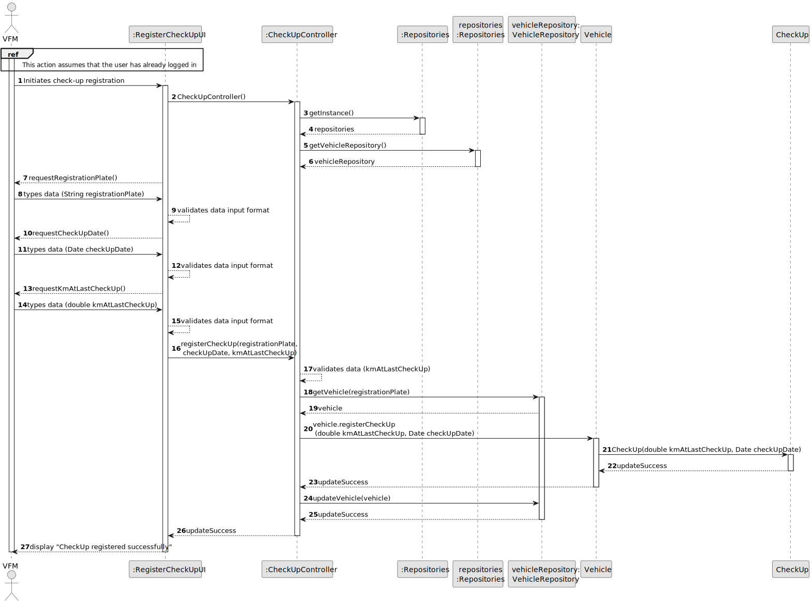
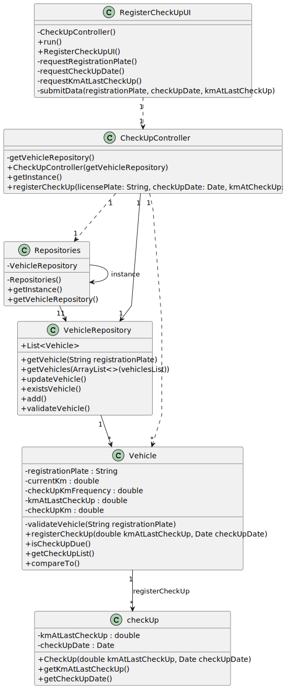

# US007 - Register a vehicle’s check-up 

## 3. Design - User Story Realization 

### 3.1. Rationale

| Interaction ID                                                             | Question: Which class is responsible for...                             | Answer            | Justification (with patterns)                                          |
|:---------------------------------------------------------------------------|:------------------------------------------------------------------------|:------------------|:-----------------------------------------------------------------------|
| Step 1 : asks to register a new check-up  		                               | ... instantiating the class that handles the UI?                        | RegisterCheckUpUI | Pure Fabrication: responsible for user interactions                    |
| 			  		                                                                    | ... coordinating the US?                                                | CheckUpController | Controller                                                             | |
| Step 7 : shows fundamental characteristics (requests registration plate)		 | ... displaying the fundamental characteristics (requested data)?							 | RegisterCheckUpUI | Pure Fabrication: responsible for user interactions                    |
| Step 8 : types requested data (registration plate)  		                     | 	...validating inputed data?                                            | RegisterCheckUpUI | Pure Fabrication : validate input format                               |
| Step 10 : shows fundamental characteristics (requested data)		             | ... displaying the fundamental characteristics (requested data)?							 | RegisterCheckUpUI | Pure Fabrication: responsible for user interactions                    |
| Step 11 : types requested data (check-up date)  		                         | 	...validating inputed data?                                            | RegisterCheckUpUI | Pure Fabrication : validate input format                               |
| Step 13 : shows fundamental characteristics (requested data)		             | ... displaying the fundamental characteristics (requested data)?							 | RegisterCheckUpUI | Pure Fabrication: responsible for user interactions                                                     |
| Step 14 : types requested data (km at last check-up)  		                   | 	...validating inputed data?                                            | RegisterCheckUpUI | Pure Fabrication : validate input format                               |
| Step 18 : get vehicle by registration plate 		                             | 	...fetching data?                                                      | CheckUpController | Controller                                                             |
| 		                                                                         | ...storing data?							                                                 | VehicleRepository | IE: has object data                                                    |
| Step 20 : requests check-up 		                                             | 	... requesting the creation of check-up?                               | CheckUpController | Controller                                                             | 
| 			  		                                                                    | 	... creating check-up?                                                 | Vehicle           | Creator (Rule 1): Vehicle agregates and records instances of check-ups | 
| 			  		                                                                    | 	... saving the edited vehicle object?                                  | VehicleRepository | IE: This repository stores all the vehicles object.                    | 
| Step 27 : operation success  		                                            | 	... informing operation success?                                       | RegisterCheckUpUI      | IE: is responsible for user interactions.                              | 

### Systematization ##

According to the taken rationale, the conceptual classes promoted to software classes are: 

* Employee
* Vehicle
* CheckUp

Other software classes (i.e. Pure Fabrication) identified: 

* RegisterCheckUpUI  
* CheckUpController

## 3.2. Sequence Diagram (SD)

### Full Diagram

This diagram shows the full sequence of interactions between the classes involved in the realization of this user story.

## 3.3. Class Diagram (CD)

