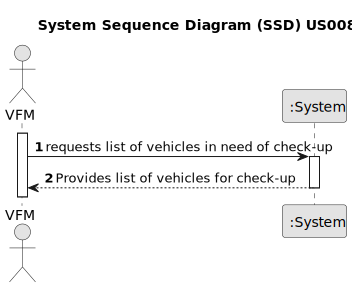

# US008 - List the vehicles needing the check-up.

## 1. Requirements Engineering

### 1.1. User Story Description

As an Vehicle and Equipment Fleet Manager, I want to list the vehicles needing the check-up.

### 1.2. Customer Specifications and Clarifications 

**From the specifications document:**

> Transcribed:	Vehicles are needed to carry out the tasks assigned to the teams as well as to transport
machines and equipment.
>
> Justification: The fleet manager needs to routinely check the maintenance status and agenda of the fleet maintenance.

**From the client clarifications:**

> **Question:** When a vehicle be listed for check-up (08/03/2024)?
>
> **Answer:** All vehicles within 5% of kilometers required for the check-up or vehicles due to the check-up.

> **Question:** What information should the list show (16/03/2024)?
>
> **Answer:** The list should show the current kilometers of the vehicle, the check-up frequency (km), last check-up kilometer counter, kilometers until next check-up.

### 1.3. Acceptance Criteria

* **AC1:** The list must include vehicles within 5% of kilometers required for the check-up.
* **AC2:** The list must include vehicles that have exceeded their check-up frequency.
* **AC3:** The list must clearly identify each vehicle through plate number, brand, model and date of last check-up.

### 1.4. Found out Dependencies

* Dependency on "US06 - Register a Vehicle" for access to vehicle records.
* Dependency on "US07 - Register Vehicle's Check-Up" for accurate maintenance history.

### 1.5 Input and Output Data

**Input Data:**

* Typed data:
  No direct input data from the user is required to generate the list.

**Output Data:**

* A list of vehicles due for check-up (plate number, brand, model and date of last check-up)

### 1.6. System Sequence Diagram (SSD)

### 1.7 Other Relevant Remarks

* The current km of the vehicles must be updated in the system every week by the Fleet Manager or collaborators, 
  in order to generate the list correctly.
