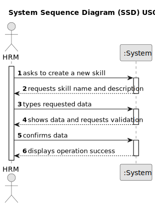

# US001 - Register a skill

## 1. Requirements Engineering

### 1.1. User Story Description

As a Human Resources Manager (HRM), I want to register skills that a collaborator may have.

### 1.2. Customer Specifications and Clarifications 

**From the specifications document:**

> Transcribed:	_An employee has a main ocupation (job) and set off skills that enable him to perform certain tasks._ 
> 
> Justification: Skill is the main element that allows HRM to allocate workers to teams to perform tasks.

**From the client clarifications:**

> **Question:** (09/03/2024) What parameters should we receive? 
>
> **Answer:** The skill name. For example: car driver, agricultural machinery operator, phytopharmaceutical applicator. 

> **Question:** (09/03/2024) The skill needs a description?
>
> **Answer:** It could be interesting because of the distance between the people who manage documentation and systems and between the people who are in the field, these types of descriptions facilitate the secretarial work.

> **Question:** (16/03/2024) Which other acceptance criteria can we consider? Using only characters?
>
> **Answer:** No digits, no special characters like hashtags or exclamation points. Can have spaces or dashes but nothing else.
>
> **Atualization:** On version 2.0 of the document provided from the client he clarified is previous answer and defined as acceptance criteria "A skill name can't have special characters or digits"

### 1.3. Acceptance Criteria

* **AC1:** All required fields must be filled in.
* **AC2:** A skill name can't have special characters or digits.
* **AC3:** The user should validate the data entered for the skill to make sure it is correct.
* **AC4:** The skill name should be in capital letters, in order to prevent duplicates.

### 1.4. Found out Dependencies

### 1.5 Input and Output Data

**Input Data:**

* Typed data:
    * a skill
    * a description 
  
	
**Output Data:**

* (In)Success of the operation

### 1.6. System Sequence Diagram (SSD)

### 1.7 Other Relevant Remarks

