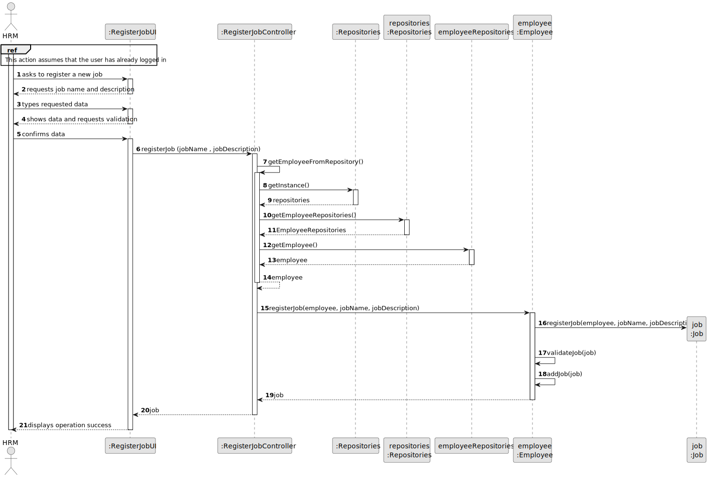
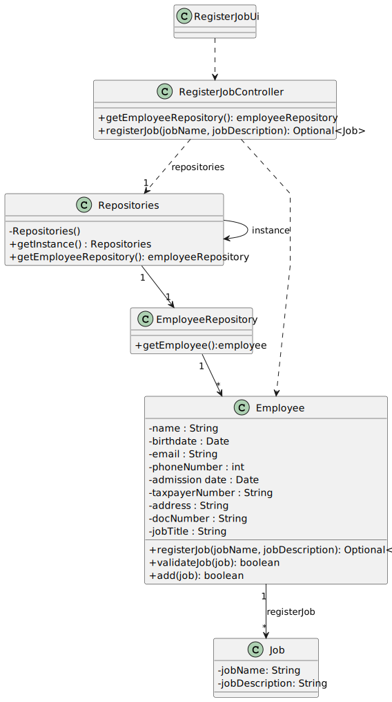

# US002 - Register a job 

## 3. Design - User Story Realization 

### 3.1. Rationale

[//]: # (_**Note that SSD - Alternative One is adopted.**_)

| Interaction ID | Question: Which class is responsible for...   | Answer                | Justification (with patterns)                                                                                 |
|:---------------|:----------------------------------------------|:----------------------|:--------------------------------------------------------------------------------------------------------------|
| Step 1  		     | 	... interacting with the actor?              | CreateJobUI           | Pure Fabrication: there is no reason to assign this responsibility to any existing class in the Domain Model. |
| 			  		        | 	... coordinating the US?                     | RegisterJobController | Controller                                                                                                    |
| 			  		        | ... knowing the user using the system?        | EmployeeRepository    | IE: knows/has HRM                                                                                             |
| Step 2  		     | 							                                       |                       |                                                                                                               |
| Step 3  		     | 							                                       |                       |                                                                                                               |
| Step 4  		     | 							                                       |                       |                                                                                                               |
| Step 5			  		  | 	... instantiating a new Job?  | Employee              | Creator (Rule 1): Employee aggregates instances of job.                                             |
| 		             | 	...saving the inputted data?                 | Job                   | IE: object created has its own data.                                                                          |
| 		             | 	... validating all data (local validation)?  | Job                   | IE: owns its data.                                                                                            | 
| 			  		        | 	... validating all data (global validation)? | Employee              | IE: knows all its jobs.                                                                                       | 
| 			  		        | 	... saving the created task?                 | Employee              | IE: owns all its jobs.                                                                                        | 
| Step 6  		     | 	... informing operation success?             | CreateJobUI           | IE: is responsible for user interactions.                                                                     | 

### Systematization ##

According to the taken rationale, the conceptual classes promoted to software classes are: 

* Employee
* Job

Other software classes (i.e. Pure Fabrication) identified: 

* CreateJobUI  
* CreateJobController
* EmployeeRepository

## 3.2. Sequence Diagram (SD)

[//]: # (_**Note that SSD - Alternative Two is adopted.**_)

### Full Diagram

This diagram shows the full sequence of interactions between the classes involved in the realization of this user story.

[//]: # (### Split Diagrams)

[//]: # (The following diagram shows the same sequence of interactions between the classes involved in the realization of this user story, but it is split in partial diagrams to better illustrate the interactions between the classes.)

[//]: # (It uses Interaction Occurrence &#40;a.k.a. Interaction Use&#41;.)

[//]: # (![Sequence Diagram - split]&#40;svg/us006-sequence-diagram-split.svg&#41;)

[//]: # (**Get Task Category List Partial SD**)

[//]: # (![Sequence Diagram - Partial - Get Task Category List]&#40;svg/us006-sequence-diagram-partial-get-task-category-list.svg&#41;)

[//]: # (**Get Task Category Object**)

[//]: # (![Sequence Diagram - Partial - Get Task Category Object]&#40;svg/us006-sequence-diagram-partial-get-task-category.svg&#41;)

[//]: # (**Get Employee**)

[//]: # (![Sequence Diagram - Partial - Get Employee]&#40;svg/us006-sequence-diagram-partial-get-employee.svg&#41;)

[//]: # (**Create Task**)

[//]: # (![Sequence Diagram - Partial - Create Task]&#40;svg/us006-sequence-diagram-partial-create-task.svg&#41;)

## 3.3. Class Diagram (CD)

