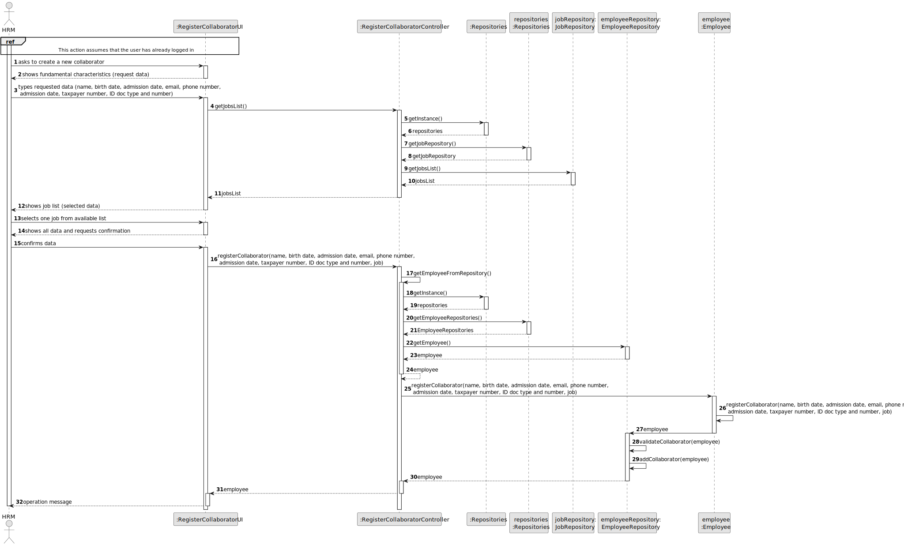
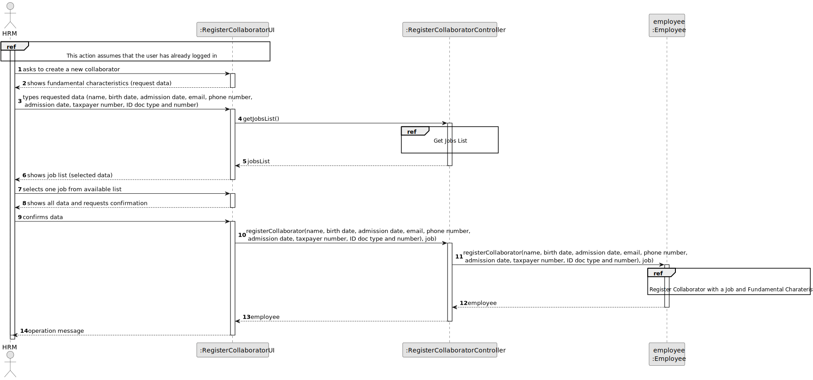
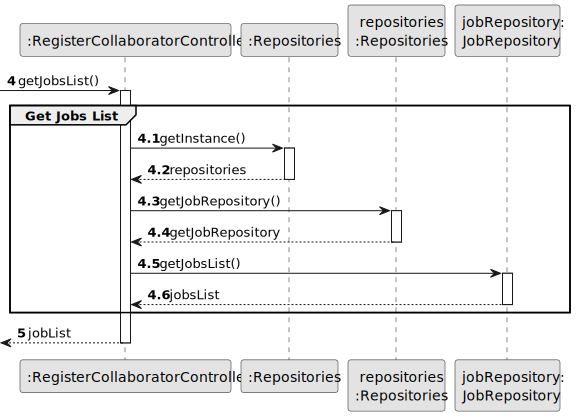
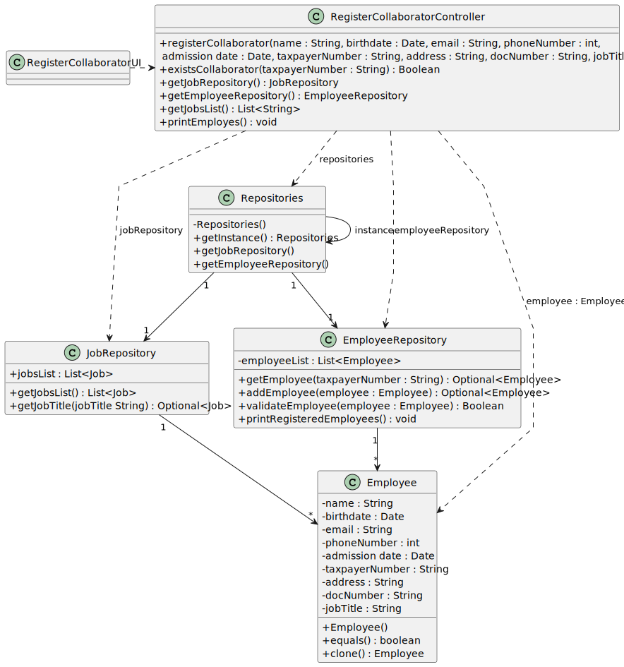

# US003 - Register a collaborator with a job and fundamental characteristics

## 3. Design - User Story Realization 

### 3.1. Rationale

| Interaction ID                                                                                                                | Question: Which class is responsible for...                                             | Answer                         | Justification (with patterns)                                                                                |
|:------------------------------------------------------------------------------------------------------------------------------|:----------------------------------------------------------------------------------------|:-------------------------------|:-------------------------------------------------------------------------------------------------------------|
| Step 1	                                                                                                                       | 	... instantiating the class that handles the UI?                                       | RegisterCollaboratorUI         | Pure Fabrication: there is no reason to assign this responsibility to any existing class in the Domain Model |
| 			  	 	                                                                                                                      | 	... coordinating the US?                                                               | RegisterCollaboratorController | Controller                                                                                                   |
| Step 2 	                                                                                                                      | 							                                                                                 |          |                                                                                              |
| Step 3	                                                                                                                       | 	...validating requested data?                                                          | RegisterCollaboratorUI         | Pure Fabrication                                                                                             |
| 		                                                                                                                            | 	...temporarily keeping requested data?                                                 | RegisterCollaboratorUI         | Pure Fabrication                                                                                             |
|                                                                                                                               | 	...showing job list?                                                                   | JobRepository                  | I.E: has all jobs registered, Pure Fabrication                                                               |
| Step 4 	                                                                                                                      | 							                                                                                 |          |                                                                                              |
| Step 5 	                                                                                                                      | 	... validating selected data?                                                          | RegisterCollaboratorUI         | Pure Fabrication                                                                                             |
| 		                                                                                                                            | 	... temporarily keeping the selected job?						                                        | RegisterCollaboratorUI         | Pure Fabrication                                                                                             |              
| Step 6  		                                                                                                                    | 						                                 |         |                                                                                           |              
| 		 Step 7		                                                                                                                   | ... knowing the user using the system?                                                  | EmployeeRepository             | IE: knows/has HRM.                                                                                            |
| 			  		                                                                                                                       | 	... creating Collaborator Object?                                                      | Employee                       | Creator 1,2: Employee aggregates and records instances of collaborator                                                                                              |
| 			  		                                                                                                                       | 	... saving inputted data?                                                              | Employee                       | IE: object created has its own data                                                                          | 
| 			  		                                                                                                                       | 	... validating all data (local validation)?                                            | EmployeeRepository             | IE: object created has its own data                                                                          | 
| 			  		                                                                                                                       | 	... validating all data (global validation)?                                           | EmployeeRepository                      | IE: knows all its Collaborators instances                                                                    | 
| Step 8 		                                                                                                                     | 	... informing operation success?                                                       | RegisterCollaboratorUI         | Pure Fabrication                                                                                             | 

### Systematization ##

According to the taken rationale, the conceptual classes promoted to software classes are: 

* Employee

Other software classes (i.e. Pure Fabrication) identified: 

* RegisterCollaboratorUI  
* RegisterCollaboratorController
* EmployeeRepository
* JobRepository

## 3.2. Sequence Diagram (SD)

### Full Diagram

This diagram shows the full sequence of interactions between the classes involved in the realization of this user story.

### Split Diagrams

The following diagram shows the same sequence of interactions between the classes involved in the realization of this user story, but it is split in partial diagrams to better illustrate the interactions between the classes.

It uses Interaction Occurrence (a.k.a. Interaction Use).

**Get Job Partial SD**

**Register Collaborator Partial SD**

## 3.3. Class Diagram (CD)

