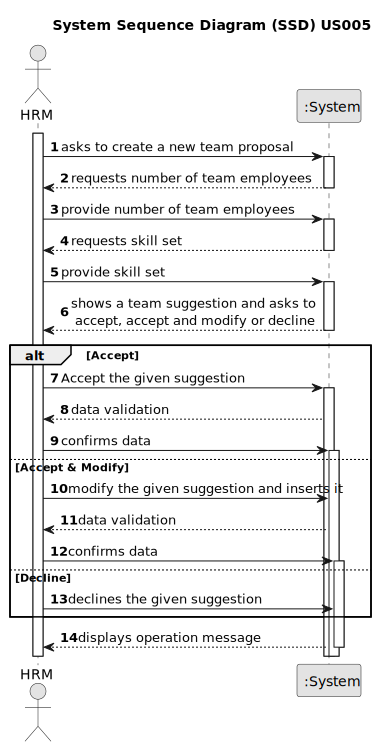

# US005 - Generate a Team proposal automatically

## 1. Requirements Engineering

### 1.1. User Story Description

As a Human Resources Manager (HRM), I want to generate a team proposal automatically.

### 1.2. Customer Specifications and Clarifications 

**From the specifications document:**

> Transcribed: _Teams are temporary associations of employees who will carry out a set of tasks in
one or more green spaces. When creating multipurpose teams, the number of members
and the set of skills that must be covered are crucial._
>
> Justification: Clarifies that the team will be assigned to a task and will have a number of employees and a set of skills.

**From the client clarifications:**

> **Question:** What can the user do with the team proposal that receives?
>
> **Answer:** He can Accept, Accept and Modify or Reject 

### 1.3. Acceptance Criteria

* **AC1:** The maximum team size and the set of skills need to be supplied by
  the HRM.
* **AC2:** The team proposal must consider collaborators availability.
* **AC3:** The team proposal must consider that the collaborators have the skills assigned.

### 1.4. Found out Dependencies

* There is a dependency on "US003 - As an HRM, I want to register a collaborator..." as there must exist collaborators to assign them to a team with a set of skills.
* There is a dependency on "US004 - As an HRM, I want to assign one or more skills to a collaborator" as there must be assigned skills to collaborators to assign them to a team with a set of skills.

### 1.5 Input and Output Data

**Input Data:**

* Typed data:
    * number of team employees
	
* Selected data:
    * team employees
    * skill set

**Output Data:**

* a team with a set of skills with a certain number of employees

### 1.6. System Sequence Diagram (SSD)

[//]: # (**_Other alternatives might exist._**)

[//]: # (#### Alternative One)

[//]: # (#### Alternative Two)

[//]: # ()
[//]: # (![System Sequence Diagram - Alternative Two]&#40;svg/us005-system-sequence-diagram-alternative-two.svg&#41;)

[//]: # (### 1.7 Other Relevant Remarks)
