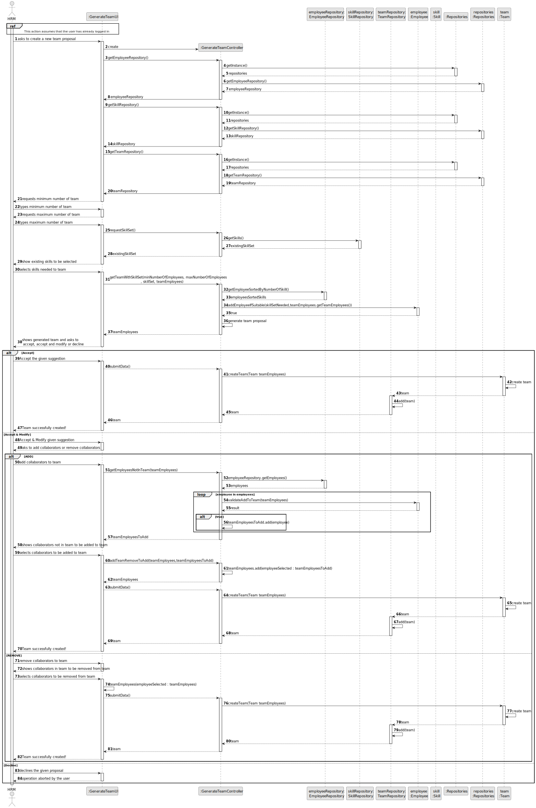
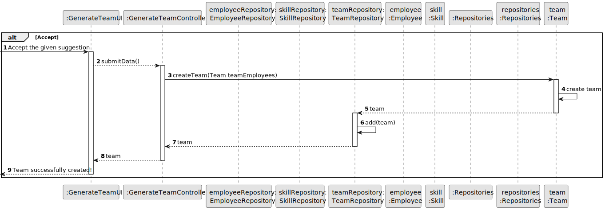
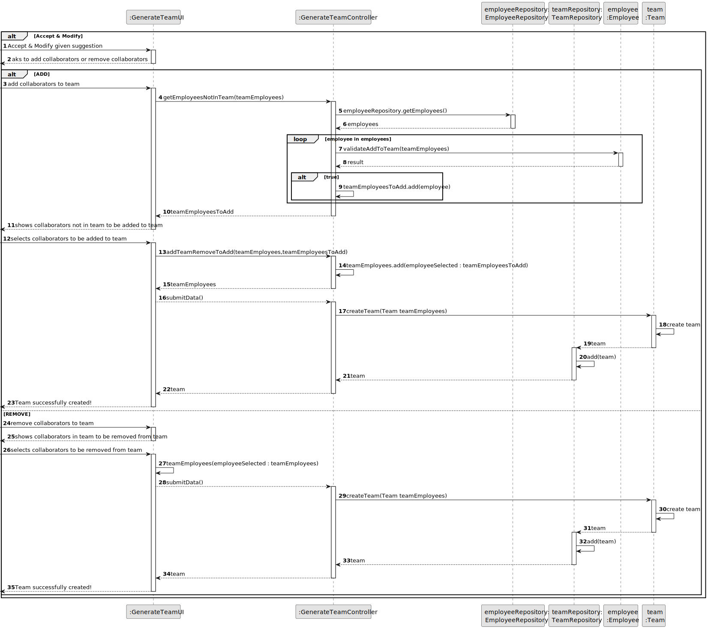
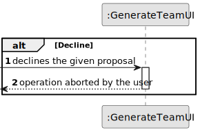

# US005 - Generate a Team proposal automatically

## 3. Design - User Story Realization 

### 3.1. Rationale

_**Note that SSD - Alternative One is adopted.**_

| Interaction ID | Question: Which class is responsible for... | Answer                 | Justification (with patterns)                                                                                 |
|:---------------|:--------------------------------------------|:-----------------------|:--------------------------------------------------------------------------------------------------------------|
| Step 1  		     | 	... interacting with the actor?            | GenerateTeamUI         | Pure Fabrication: there is no reason to assign this responsibility to any existing class in the Domain Model. |
| 			  		        | 	... coordinating the US?                   | GenerateTeamController | Controller                                                                                                    |
| Step 2  		     | 							                                     |                        |                                                                                                               |
| Step 3  		     | 	... interacting with the actor?            | GenerateTeamUI         | Pure Fabrication: is responsible for user interaction.                                                        |
| 		             | 	... coordinating the US?                   | GenerateTeamController | Controller                                                                                                    |
| 		             | 	... get all skills?                        | SkillRepository        | IE: knows all its skills.                                                                                     |
| Step 4  		     | 	                                           |                        |                                                                                                               |
| Step 5  		     | 	... interacting with the actor?            | GenerateTeamUI         | Pure Fabrication: is responsible for user interaction.                                                        |
| 		             | 	... coordinating the US?                   | GenerateTeamController | Controller.                                                                                                   |
| 		             | 	... get all employees?                     | EmployeeRepository     | IE: knows all its employees.                                                                                  |
| Step 6  		     | 							                                     |                        |                                                                                                               |              
| Step 7  		     | 	... interacting with the actor?            | GenerateTeamUI         | Pure Fabrication: is responsible for user interaction.                                                        |
| 		             | 	... coordinating the US?                   | GenerateTeamController | Controller                                                                                                    |
| 		             | 	... create a team?                         | Team                   | Creator: R(2).                                                                                                |
| 		             | 	... saving the team?                       | TeamRepository         | IE: owns all its teams.                                                                                       |
| Step 10  		    | 	... interacting with the actor?            | GenerateTeamUI         | Pure Fabrication: is responsible for user interaction.                                                        |
| 		             | 	... coordinating the US?                   | GenerateTeamController | Controller                                                                                                    |
| 		             | 	... modify the team?                       | TeamRepository         | IE: owns all its teams.                                                                                       |
| 		             | 	... create a team?                         | Team                   | Creator: R(2).                                                                                                |
| 		             | 	... saving the team?                       | TeamRepository         | IE: owns all its teams.                                                                                       |
| Step 13  		    | 	... interacting with the actor?            | GenerateTeamUI         | Pure Fabrication: is responsible for user interaction.                                                        |
### Systematization ##

According to the taken rationale, the conceptual classes promoted to software classes are: 

* Team

Other software classes identified: 

* GenerateTeamUI  
* GenerateTeamController
* SkillRepository
* EmployeeRepository

## 3.2. Sequence Diagram (SD)

_**Note that SSD - Alternative Two is adopted.**_

### Full Diagram

This diagram shows the full sequence of interactions between the classes involved in the realization of this user story.

### Accept Diagram

This diagram shows the Accept sequence of interactions between the classes involved in the realization of this user story.

### Accept and Modify Diagram

This diagram shows the Accept and Modify sequence of interactions between the classes involved in the realization of this user story.

### Decline Diagram

This diagram shows the Decline sequence of interactions between the classes involved in the realization of this user story.

## 3.3. Class Diagram (CD)

