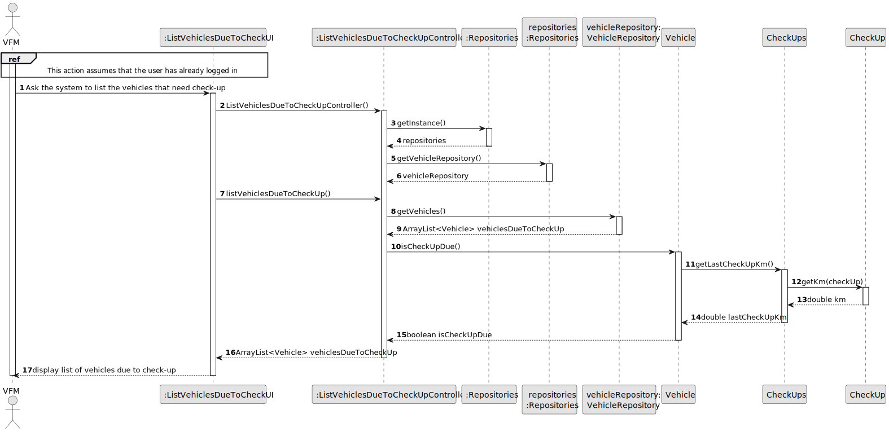
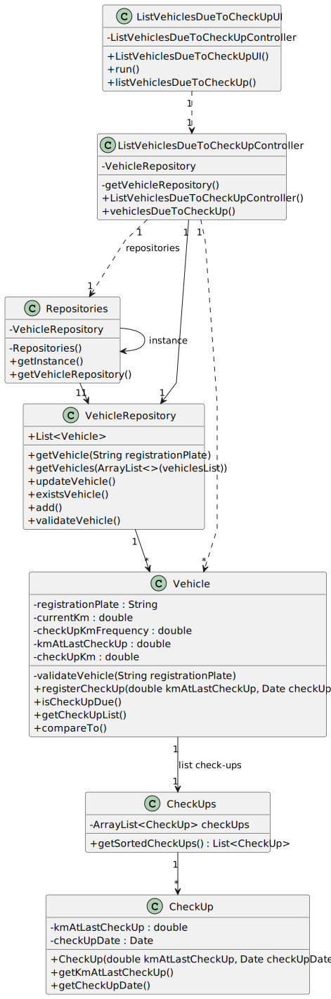

# US008 - List the vehicles needing the check-up 

## 3. Design - User Story Realization 

### 3.1. Rationale

| Interaction ID                                     | Question: Which class is responsible for...                             | Answer                             | Justification (with patterns)                       |
|:---------------------------------------------------|:------------------------------------------------------------------------|:-----------------------------------|:----------------------------------------------------|
| Step 1 : asks to list vehicles due to check-up  		 | ... instantiating the class that handles the UI?                        | ListVehiclesDueToCheckUI           | Pure Fabrication: responsible for user interactions |
| 			  		                                            | ... coordinating the US?                                                | ListVehiclesDueToCheckUpController | Controller                                          |
| Step 10 : check if vehicle is due to check-up		    | ... fetching the list of vehicles?							                               | ListVehiclesDueToCheckUpController | Controller                                          |
|                                                    | 	...storing list of vehicles?                                           | VehicleRepository                  | IE: stores all vehicles instances                   |
| 		                                                 | ... check if check-up is due?							                                    | Vehicle                            | IE: stores business logic related to itself         |
| Step 17 : display list to user  		                 | 	...displaying list?                                              | ListVehiclesDueToCheckUI                  | Pure Fabrication: responsible for user interactions |

### Systematization ##

According to the taken rationale, the conceptual classes promoted to software classes are: 

* Employee
* Vehicle
* CheckUp

Other software classes (i.e. Pure Fabrication) identified: 

* ListVehiclesDueToCheckUI
* ListVehiclesDueToCheckUpController

## 3.2. Sequence Diagram (SD)

### Full Diagram

This diagram shows the full sequence of interactions between the classes involved in the realization of this user story.

## 3.3. Class Diagram (CD)

