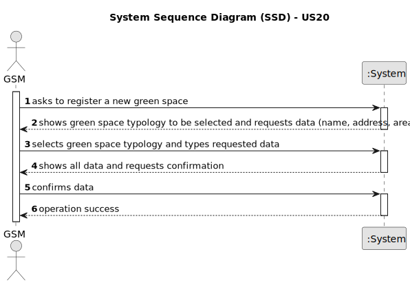

# US20 - Register a green space (garden, medium-sized park or large-sized park) and its respective area

## 1. Requirements Engineering

### 1.1. User Story Description

As a Green Space Manager (GSM), I want to register a green space (garden, medium-sized park or large-sized park) and its respective area.

### 1.2. Customer Specifications and Clarifications 

**From the specifications document:**

>	The green spaces for collective use, often called ”gardens” and ”parks”, are fundamental for people’s quality of life, especially in urban or semi-urban contexts.

>	Green spaces for collective use can vary significantly in dimensions and available amenities.

>	The green spaces for collective use managed by MS can significantly vary in size and installed equipment:
• Garden - garden space with or without trees with little or no equipment (may have a basic irrigation system or/and benches);
• Medium-sized park - green space with a few hundred or thousands of square meters with a wooded garden area, it includes some infrastructures such as toilets, drinking fountains, irrigation system, lighting, children’s playground (for example, Quinta do Covelo, Jardim d’Arca de ´ Agua);
• Large-sized park - multi-function space with diverse garden spaces, and woods, including varied equipment and services (for example, Parque da Cidade).

**From the client clarifications (Questions posted on Moodle):**

> **Question:** In which unit should the area be measured in?
>
> **Answer:**  Usually, areas are measured in hectares.

> **Question:** We understand that type (garden, medium-size, large-size), area, name, and address are required inputs for a Green Space (and if we are wrong in this, please correct us), but are there any other inputs that we are unaware of?
>
> **Answer:** Seems enough.

> **Question:** To register a green space, what is the criteria needed to classify it as a medium-sized park or a large-sized park?
>
> **Answer:** It's a GSM responsibility to decide the classification.

> **Question:** Can two green spaces have the same name?
>
> **Answer:** No.

> **Question:** Good afternoon, I would like to know between what ranges of hectares a green space is classified as garden, medium or large, or if it is possible to register 2 green spaces with the same area but in different typology, depending on the GSM it registers.
>
> **Answer:** FALTA RESPOSTA!!!!!

### 1.3. Acceptance Criteria

* **AC1:** All required fields must be filled in (green space typology, area, name, and address)
* **AC2:** Area must only have digits
* **AC3:** The green space name should be in capital letters, in order to prevent duplicates.
* **AC4:** Area and typology must match (FALTA RESPOSTA).

### 1.4. Found out Dependencies

* There is a dependency on "US003 - Register a collaborator with a job and fundamental characteristics" as there must be at least one collaborator registered with the job of GSM.

### 1.5 Input and Output Data

**Input Data:**

* Typed data:
    * name
    * address
    * area

* Selected data:
    * green space typology

**Output Data:**

* (In)Success of the operation

### 1.6. System Sequence Diagram (SSD)

### 1.7 Other Relevant Remarks

* The area must be in hectares.