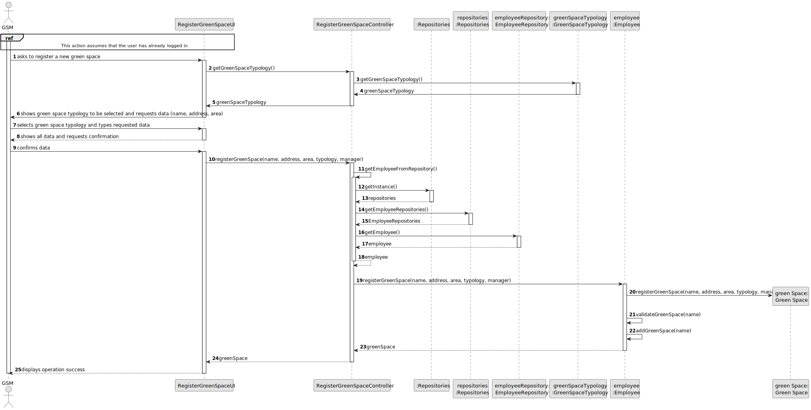
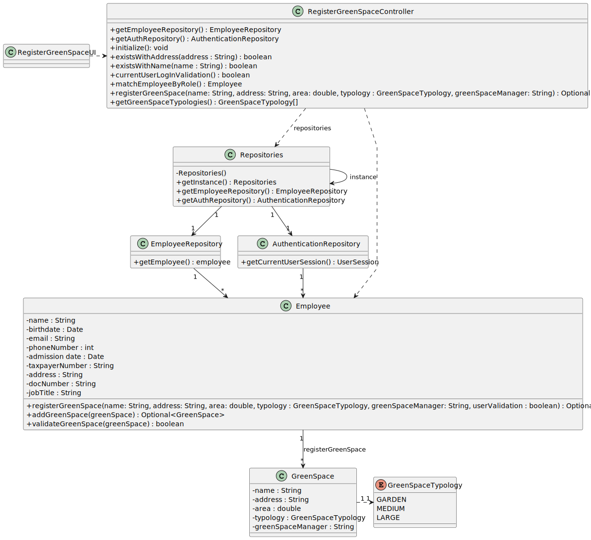

# US20 - As a Green Space Manager (GSM), I want to register a greenspace (garden, medium-sized park or large-sized park) and its respectivearea.

## 3. Design - User Story Realization 

### 3.1. Rationale

| Interaction ID | Question: Which class is responsible for...   | Answer                       | Justification (with patterns)                                                                                 |
|:---------------|:----------------------------------------------|:-----------------------------|:--------------------------------------------------------------------------------------------------------------|
| Step 1  		     | 	... interacting with the actor?              | RegisterGreenSpaceUI         | Pure Fabrication: there is no reason to assign this responsibility to any existing class in the Domain Model. |
| 			  		        | 	... coordinating the US?                     | RegisterGreenSpaceController | Controller                                                                                                    |
| 			  		        | ... knowing the user using the system?        | EmployeeRepository           | IE: knows/has HRM                                                                                             |
| Step 2  		     | 							                                       |                              |                                                                                                               |
| Step 3	        | 	...validating requested data?                | RegisterGreenSpaceUI         | Pure Fabrication                                                                                              |
| 		             | 	...temporarily keeping requested data?       | RegisterGreenSpaceUI         | Pure Fabrication                                                                                              |
| Step 4  		     | 	                                             |                              |                                                                                                               |
| Step 5         | 	...temporarily keeping requested data?       | RegisterGreenSpaceUI         | Pure Fabrication                                                                                              |
| 	              | 	... creating Green Space Object?             | Employee                     | Creator (Rule 1): the Employee aggregates instances of green space.                                           |
| 		             | 	... validating all data (local validation)?  | GreenSpace                   | IE: object created has its own data                                                                           |
| 		             | 	... validating all data (global validation)? | Employee                     | 	IE: knows all its GreenSpaces instances                                                                      |
| 		             | 	... saving inputted data?                    | GreenSpace         | IE: object created has its own data.                                                                                |
| Step 6 		      | 	... informing operation success?             | RegisterGreenSpaceUI         | IE: is responsible for user interactions.                                                                     | 

### Systematization ##

According to the taken rationale, the conceptual classes promoted to software classes are: 

* GreenSpace
* Employee

Other software classes (i.e. Pure Fabrication) identified: 

* RegisterGreenSpaceUI  
* RegisterGreenSpaceController
* EmployeeRepository

## 3.2. Sequence Diagram (SD)

### Full Diagram

This diagram shows the full sequence of interactions between the classes involved in the realization of this user story.

## 3.3. Class Diagram (CD)

