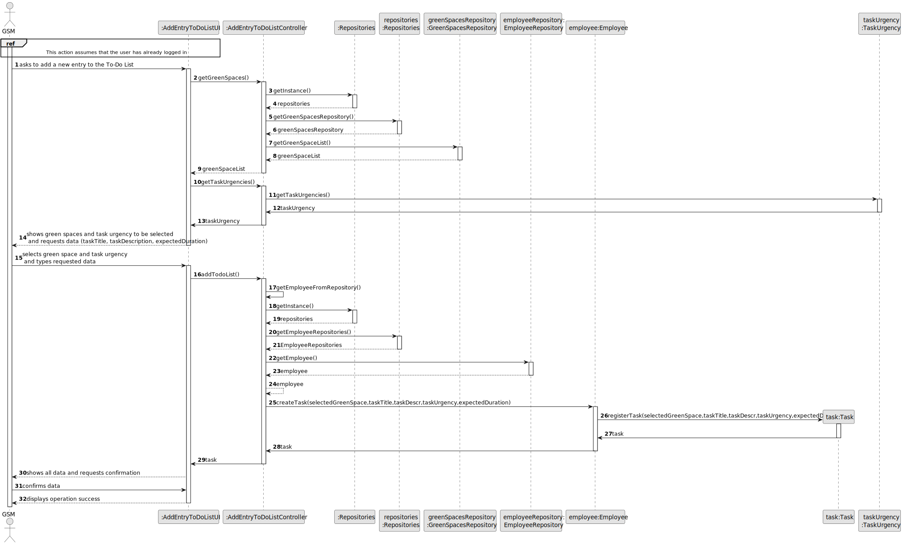
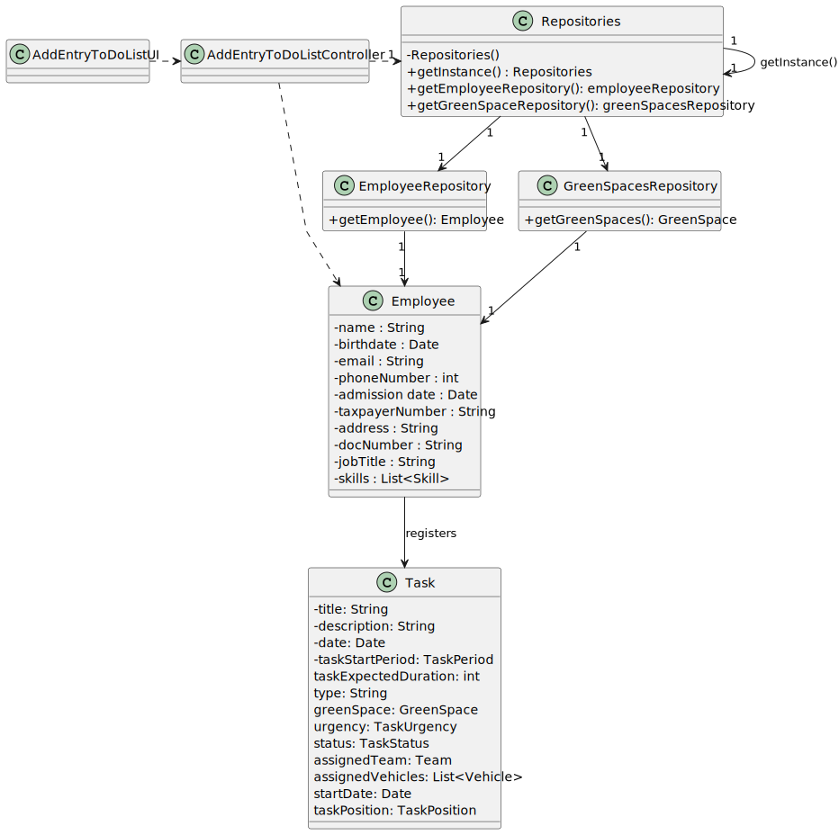

# US021 - As a GSM, I want to add a new entry to the To-Do List

## 3. Design - User Story Realization 

### 3.1. Rationale

|     | Interaction ID | Question: Which class is responsible for...       | Answer                     | Justification (with patterns)                                                                                 |
|:----|:---------------|:--------------------------------------------------|:---------------------------|:--------------------------------------------------------------------------------------------------------------|
|     | Step 1  		     | 	... interacting with the actor?                  | AddEntryToDoListUI         | Pure Fabrication: there is no reason to assign this responsibility to any existing class in the Domain Model. |
|     | 			  		        | 	... coordinating the US?                         | AddEntryToDoListController | Controller                                                                                                    |
|     | 			  		        | ... knowing the user using the system?            | EmployeeRepository         | IE: knows the GSM                                                                                             |
|     | Step 2  		     | 		... show available green spaces entries?					   | GreenSpaceRepository       | IE: Knows all entries (green spaces).                                                                         |
|     | 		             | 		... show available task urgencies entries?					 | TaskUrgency                | IE: Knows all entries (task urgencies).                                                                       |
|     | Step 3  		     | 	...validating selected data?                     | AddEntryToDoListUI         | Pure Fabrication: validates fields                                                                            |
|     | Step 4  		     | 	                                                 |                            |                                                                                                               |
|     | 	Step 5	       | 	... register task to to-do list entry?           | Employee                   | IE: knows green spaces and task urgencies                                                                     |
|     | 		             | 	... validating all data (local validation)?      | Task                       | IE: owns its data.                                                                                            | 
|     | 			  		        | 	... validating all data (global validation)?     | Employee                   | IE: knows all to-do list entries.                                                                             | 
|     | 			  		        | 	... saving the selected data?                    | Employee                   | IE: owns all to-do list entries.                                                                              | 
|     | Step 8  		     | 	... informing operation success?                 | AddEntryToDoListUI         | IE: is responsible for user interactions.                                                                     | 

### Systematization ##

According to the taken rationale, the conceptual classes promoted to software classes are: 

* Employee
* Task

Other software classes (i.e. Pure Fabrication) identified: 

* AddEntryToDoListUI  
* AddEntryToDoListController

## 3.2. Sequence Diagram (SD)

### Full Diagram

This diagram shows the full sequence of interactions between the classes involved in the realization of this user story.

## 3.3. Class Diagram (CD)

