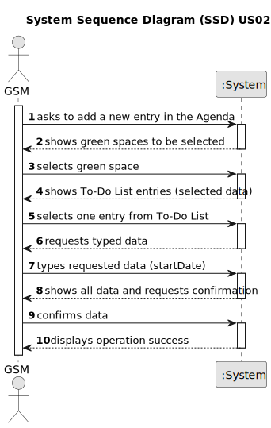

# US22 - As a GSM, I want to add a new entry in the Agenda.

## 1. Requirements Engineering

### 1.1. User Story Description

As a GSM, I want to add a new entry in the Agenda.

### 1.2. Customer Specifications and Clarifications 

**From the specifications document:**

>	Transcribed: The Agenda is a crucial mechanism for planning the week’s work. Each entry in the Agenda defines a task (that was previously included in the to-do list). 
In the daily management, the GSM uses two essential tools: the Agenda and the Task List (aka To-Do List).
> 
> Justification: The way GSM manages the needs of the green spaces managed by him.

>	Transcribed: Comparatively analyzing the Agenda entries and the pending tasks (to-do list) allows you to evaluate the work still to be done, the busyness of the week, and the work performed by a team in a green space at a determined time interval and on a specific date.
>
> Justification: Importance of the Agenda that allows the GSM to effectively organize the work during a period of time.

>	Transcribed: The Agenda is made up of entries that relate to a task (which was previously in the To-Do List), the team that will carry out the task, the vehicles/equipment assigned to the task, expected duration, and the status (Planned, Postponed, Canceled, Done).
>
> Justification: Relation between Agenda and To-Do List and all people and equipment needed to perform a task in a green space. 

>	Transcribed: The Agenda is made up of entries that relate to a task (which was previously in the To-Do List), the team that will carry out the task, the vehicles/equipment assigned to the task, expected duration, and the status (Planned, Postponed, Canceled, Done).
>
> Justification: Relation between Agenda and To-Do List and all people and equipment needed to perform a task in a green space.

**From the client clarifications (Questions posted and answered by the client on Moodle):**

> **Question:** We also know that an Agenda entry has a target date, but is this target date supposed to be inputted upon transferring a task from the to-do list to the agenda, or is it supposed to be inputted upon creating the task in the to-do list?
>
> **Answer:** To-do list entries doesn't have dates!

> **Question:** Similarly, when a new entry is added to the Agenda, the status of that task will be, by default, set to "planned", right?
>
> **Answer:** "Pending" as default for to-do list entries and "Planned" as default for Agenda entries, sounds good;

> **Question:** When the GSM plans a task (that was previously in To-Do) into the Agenda, what aditional data/information does he need to input when planning?
>
> **Answer:** The starting date for the task. Later the GSM will be able to add the Team and vehicles (if required).

> **Question:** Can I add an entry that has a time period that already have an existing entry in the Agenda?
>
> **Answer:** Yes, because:
a) there are many parks to manage
b) different tasks can be executed at same time in the same park.

> **Question:** Regarding the US022, when we are registering an entry to the agenda, are the three inputs (selecting an existing task from the to-do list, starting date, and finishing date) sufficient?
>
> **Answer:** The starting date will be enough because the task already has the predicted duration.

### 1.3. Acceptance Criteria

* **AC1:** The new entry must be associated with a green space managed by the GSM.
* **AC2:** The new entry must exist in the To-Do list.
* **AC3:** The new entry must be associated with a starting date.

### 1.4. Found out Dependencies

* There is a dependency on "US20 - Register a green space (garden, medium-sized park or large-sized park) and its respective area" as the new entry must be associated with a green space.
* There is a dependency on "US21 - Add a new entry to the To-Do List" as the new entry must exist in the to-do list.

### 1.5 Input and Output Data

**Input Data:**

* Typed data:
    * startDate
	
* Selected data:
    * green space
    *  entry from To-Do List

**Output Data:**

* (In)Success of the operation

### 1.6. System Sequence Diagram (SSD)

### 1.7 Other Relevant Remarks

* If GSM wants to add a new entry in the agenda that it is not in the To-Do List, GSM must previously add that task to the To-Do List.