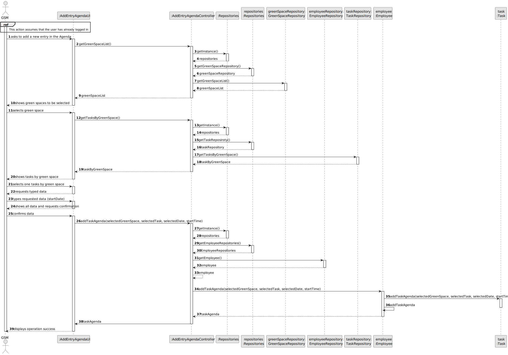

# US22 - Add a new entry in the Agenda

## 3. Design - User Story Realization 

### 3.1. Rationale

| Interaction ID | Question: Which class is responsible for...             | Answer                   | Justification (with patterns)                                                                                 |
|:---------------|:--------------------------------------------------------|:-------------------------|:--------------------------------------------------------------------------------------------------------------|
| Step 1  		     | 	... interacting with the actor?                        | AddEntryAgendaUI         | Pure Fabrication: there is no reason to assign this responsibility to any existing class in the Domain Model. |
| 			  		        | 	... coordinating the US?                               | AddEntryAgendaController | Controller                                                                                                    |
| 			  		        | ... knowing the user using the system?                  | EmployeeRepository       | IE: knows/has HRM                                                                                             |
|                | 	...showing green space list?                           | GreenSpaceRepository     | I.E: has all green spaces registered, Pure Fabrication                                                        |
| Step 2  		     | 							                                                 |                          |                                                                                                               |
| Step 3	        | 	...validating selected data?                           | AddEntryAgendaUI         | Pure Fabrication                                                                                              |
| 		             | 	...temporarily keeping selected data?                  | AddEntryAgendaUI         | Pure Fabrication                                                                                              |
|                | 	...showing To-Do List entries?                         |  TaskRepository          | I.E: has all green spaces registered, Pure Fabrication                                                        |
| Step 4  		     | 	                                                       |                          |                                                                                                               |
| Step 5 	       | 	... validating selected data?                          | AddEntryAgendaUI         | Pure Fabrication                                                                                              |
| 		             | 	... temporarily keeping the selected To-Do List entry? | AddEntryAgendaUI         | Pure Fabrication                                                                                              |              
| Step 6  		     | 							                                                 |                          |                                                                                                               |              
| Step 7         | 	......validating requested data? ?                     | AddEntryAgendaUI         | Pure Fabrication                                                                                              |
|                | 	...temporarily keeping requested data?                 | AddEntryAgendaUI         | Pure Fabrication                                                                                              |
| Step 8  		     | 							                                                 |                          |                                                                                                               |              
| Step 9 	       | 	... creating Agenda Object?                            | Task                     | Creator                                                                                                       |
| 		             | 	... validating all data (local validation)?            | Task                     | IE: object created has its own data                                                                           |
| 		             | 	... validating all data (global validation)?           | Employee                     | 	IE: knows all its Agenda instances                                                                           |
| 		             | 	... saving inputted data?                              | Employee           | IE: object created has its own data                                                                           |
| Step 10  		    | 	... informing operation success?                       | AddEntryAgendaUI         | IE: is responsible for user interactions.                                                                     | 

### Systematization ##

According to the taken rationale, the conceptual classes promoted to software classes are: 

* Task

Other software classes (i.e. Pure Fabrication) identified: 

* AddEntryAgendaUI  
* AddEntryAgendaController
* GreenSpaceRepository
* EmployeeRepository
* TaskRepository

## 3.2. Sequence Diagram (SD)

### Full Diagram

This diagram shows the full sequence of interactions between the classes involved in the realization of this user story.

## 3.3. Class Diagram (CD)

