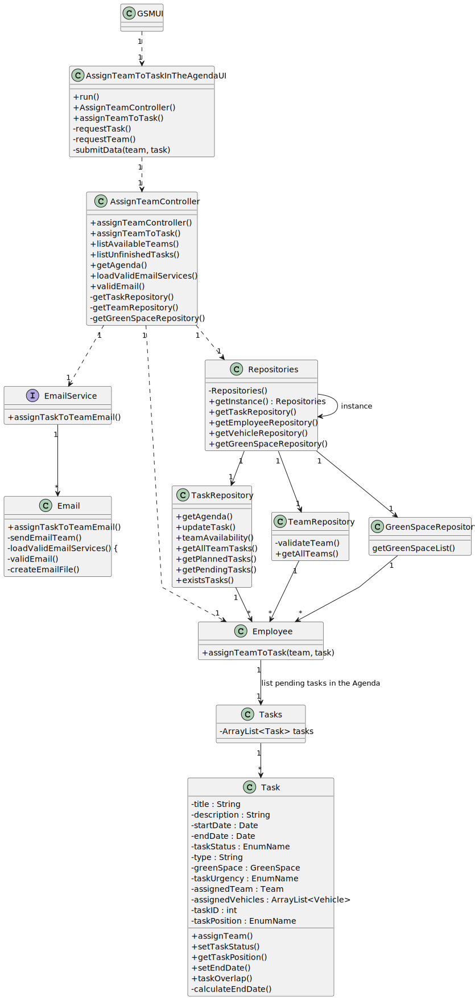

# US023 - As a GSM, I want to assign a Team to an entry in the Agenda

## 3. Design - User Story Realization 

### 3.1. Rationale

| Interaction ID                                                                 | Question: Which class is responsible for...       | Answer                        | Justification (with patterns)                                                                                 |
|:-------------------------------------------------------------------------------|:--------------------------------------------------|:------------------------------|:--------------------------------------------------------------------------------------------------------------|
| Step 1: asks to assign team to a task in the agenda  		                        | 	... instantiating the class that handles the UI? | AssignTeamToTaskInTheAgendaUI | Pure Fabrication: responsible for user interactions                                                           |
| 			  		                                                                        | 	... coordinating the US?                         | AssignTeamController          | Controller                                                                                                    |
| Step 2 : get list of tasks in the Agenda without Planned status                | 		...fetching data?						                         | ...fetching data?             | Controller                                                                                                    |
| 			  		                                                                        | 	... displaying the fundamental characteristics?  | AssignTeamToTaskInTheAgendaUI | Pure Fabrication: responsible for user interactions                                                                              |
| Step 4 : prints list of available tasks in the Agenda and asks to select one		 | 	... displaying the fundamental characteristics?  | AssignTeamToTaskInTheAgendaUI | Pure Fabrication: responsible for user interactions                                                           |
| Step 5 : requests to assign a team to a task 		                                                                   | 	... requesting the registration of a team?       | AssignTeamController          | Controller                                                                                                    |
| 		                                                                             | 	... creates assignment?                          | Employee                      | Creator (Rule 1): Vehicle agregates and records instances of check-ups                                                   |
|   		     | 	...saving the inputted data?                 | Tasks                   | IE: object created has its own data.                                                                          |
|		     | 	... saving the inputted data?  | taskRepository          | IE: This repository stores all tasks.                                                                         |
| 			  		        | 	... saving the inputted data? | agendaRepository        | IE: This repository stores all tasks in the Agenda.                                                           | 
| Step 6  		     | 	... informing operation success?             | AssignTeamToTaskInTheAgendaUI         | Pure Fabrication: responsible for user interactions                                                                   | 

### Systematization ##

According to the taken rationale, the conceptual classes promoted to software classes are: 

* Employee
* Task
* Agenda

Other software classes (i.e. Pure Fabrication) identified: 

* AssignTeamToTaskInTheAgendaUI  
* AssignTeamController

## 3.2. Sequence Diagram (SD)

### Full Diagram

This diagram shows the full sequence of interactions between the classes involved in the realization of this user story.

## 3.3. Class Diagram (CD)

