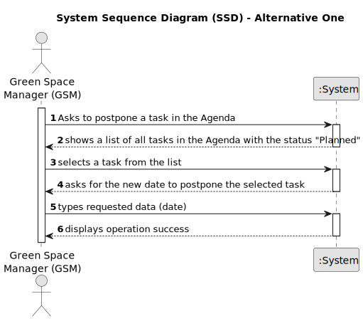

# US024 - As a GSM, I want to Postpone an entry in the Agenda to a specific future date. 

## 1. Requirements Engineering

### 1.1. User Story Description

As Green Space Manager (GSM), I want to modify the date of a task, in the Agenda, to a specific future date.

### 1.2. Customer Specifications and Clarifications 

**From the specifications document:**

> Transcribed: The Agenda is made up of entries that relate to a task (which was previously in the To-Do List), the team that will 
carry out the task, the vehicles/equipment assigned to the task, expected duration, and the status (Planned, Postponed, 
Canceled, Done).

> Justification: The GSM may need to postpone a task to a future date due to unforeseen circumstances.

**From the client clarifications:**

> **Question:** Do postponed tasks need to have a defined date? Or they stay in a "postponed" state until the GSM 
decides to schedule them?
>
> **Answer:** When postponing a task from the Agenda, the GSM must define a future date for the task to be executed.

> **Question:** The date you want to postpone in this US24 is the date referring to the "approximate expected duration" 
field when we registered the task?

> **Answer:** No; sometimes, for various reasons (e.g. insufficient staff, faulty equipment or adverse weather 
conditions) a task has to be postponed to a new date; task duration is not directly related to this.

> **Question:** The selected task(s) will be postponed by one interval defined by the user or for the next day??
>
> **Answer:** When postponing a task, the new predicated date for execution should be inserted.

> **Question:** What are the input to postpone an entry? From my perspective the Green Spaces Manager only needs to select the entry and introduce the new date.
>
> **Answer:** Yes.

> **Question:** Should the team be generated like in the us05 or should each element be selected manually
>
> **Answer:** No.

### 1.3. Acceptance Criteria

* **AC1:** All required fields must be filled in.
* **AC2:** To postpone a task, it must have the "Planned" status in the Agenda.
* **AC3:** To postpone a task, the GSM must define a new date for the task to be executed.
* **AC4:** The postponed task must clear the assigned team and vehicles of the previous registration in the Agenda.

### 1.4. Found out Dependencies

* There is a dependency on "US022 - Add a new entry in the Agenda" as there must be a task in the Agenda to be
  assigned to a team.

* There is a dependency on "US023 - As a GSM, I want to assign a team to a task in the Agenda" as the task must have a team already assigned and have planned status.

### 1.5 Input and Output Data

**Input Data:**

* Typed data:
    * a new date
	
* Selected data:
  * a task from the Agenda (with planned status)

**Output Data:**

* (In)Success of the operation

### 1.6. System Sequence Diagram (SSD)

### 1.7 Other Relevant Remarks

