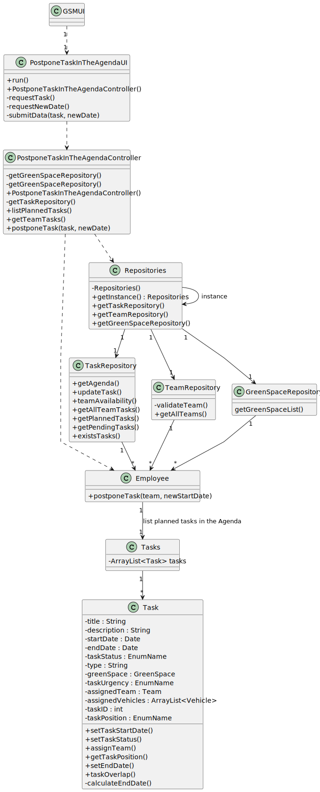

# US024 - As a GSM, I want to Postpone an entry in the Agenda to a specific future date.

## 3. Design - User Story Realization 

### 3.1. Rationale

| Interaction ID                                               | Question: Which class is responsible for...            | Answer                            | Justification (with patterns)                                                           |
|:-------------------------------------------------------------|:-------------------------------------------------------|:----------------------------------|:----------------------------------------------------------------------------------------|
| Step 1: asks to postpone task in the agenda  		              | 	... instantiating the class that handles the UI?      | PostponeTaskInTheAgendaUI         | Pure Fabrication: responsible for user interactions                                     |
| 			  		                                                      | 	... coordinating the US?                              | PostponeTaskInTheAgendaController | Controller                                                                              |
| Step 2 : get list of tasks in the Agenda with Planned status | 	... fetching the list of planned tasks?               | PostponeTaskInTheAgendaController | Controller                                                                              |
| 			  		                                                      | 		...displaying list?					                             | PostponeTaskInTheAgendaUI         | Pure Fabrication: responsible for user interactions                                     |
| Step 5 : requests task to be postponed to a new date  		     | 	...requests the update of a task in the agenda?       | PostponeTaskInTheAgendaController | Controller                                                                              |
| 		                                                           | 	... edits task in the Agenda ?                        | Employee                          | Creator (Rule 1): Employee is responsible to register and manage the task in the Agenda |
| 		                                                           | 	... saving the input data?					                       | agendaRepository                  | IE: This repository stores all tasks.                                                   |              
| Step 6 : display operation success  		                       | 	... informing operation success?                      | PostponeTaskInTheAgendaUI| Pure Fabrication: responsible for user interactions                                     | 

### Systematization ##

According to the taken rationale, the conceptual classes promoted to software classes are: 

* Employee
* Task

Other software classes (i.e. Pure Fabrication) identified: 

* PostponeTaskInTheAgendaController  
* PostponeTaskInTheAgendaUI

## 3.2. Sequence Diagram (SD)

### Full Diagram

This diagram shows the full sequence of interactions between the classes involved in the realization of this user story.

## 3.3. Class Diagram (CD)

