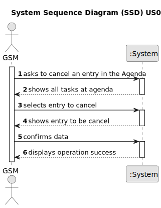

# US025 - Cancel an entry in the Agenda 

## 1. Requirements Engineering

### 1.1. User Story Description

As a GSM, I want to Cancel an entry in the Agenda.

### 1.2. Customer Specifications and Clarifications 

**From the specifications document:**

>	The Agenda is made
up of entries that relate to a task (which was previously in the To-Do List),
the team that will carry out the task, the vehicles/equipment assigned to
the task, expected duration, and the status (Planned, Postponed, Canceled,
Done).

### 1.3. Acceptance Criteria

* **AC1:** A canceled task should not be deleted but rather change its state.

### 1.4. Found out Dependencies

* There is a dependency on "US022 - Add a new entry in the Agenda" as there must be at least one entry to be canceled.

### 1.5 Input and Output Data

**Input Data:**

* Selected data:
    * Agenda entry

**Output Data:**

* (In)Success of the operation

### 1.6. System Sequence Diagram (SSD)

