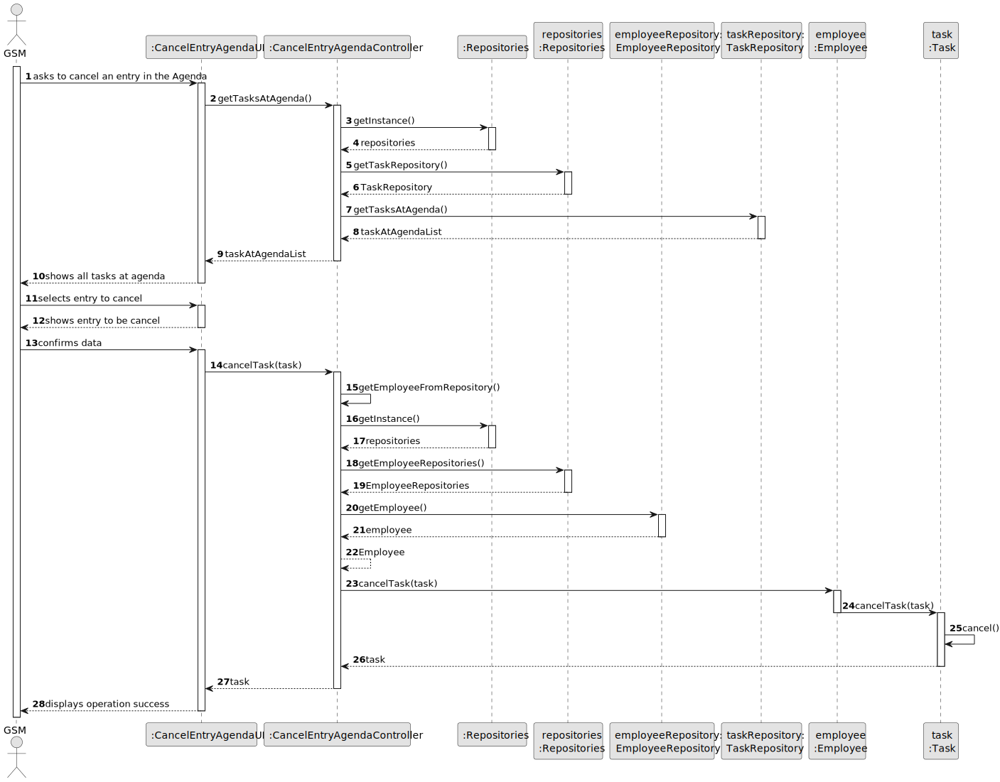
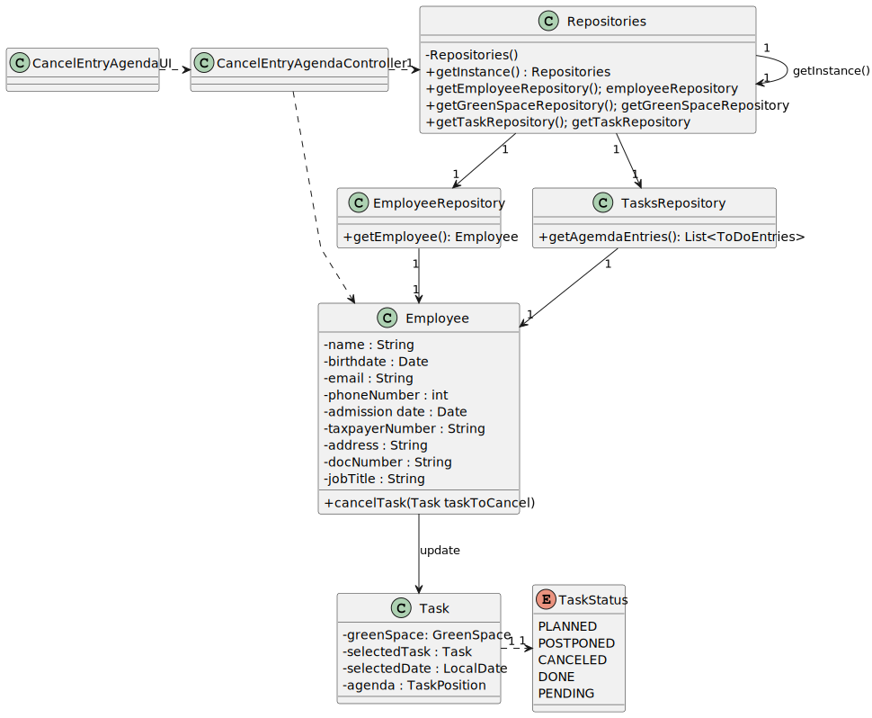

# US025 - As a GSM, I want to Cancel an entry in the Agenda

## 3. Design - User Story Realization 

### 3.1. Rationale

| Interaction ID | Question: Which class is responsible for...  | Answer                      | Justification (with patterns)                                                                                 |
|:---------------|:---------------------------------------------|:----------------------------|:--------------------------------------------------------------------------------------------------------------|
| Step 1  		     | 	... interacting with the actor?             | CancelEntryAgendaUI         | Pure Fabrication: there is no reason to assign this responsibility to any existing class in the Domain Model. |
| 			  		        | 	... coordinating the US?                    | CancelEntryAgendaController | Controller                                                                                                    |
| 			  		        | ... knowing the user using the system?       | EmployeeRepository          | IE: knows the GSM                                                                                             |
| Step 2  		     | 		... show available agenda entries?					    | TaskRepository              | IE: Knows all entries (tasks).                                                                                |
| Step 3  		     | 	...validating selected data?                | AddEntryToDoListUI          | Pure Fabrication: validates fields                                                                            |
| Step 4  		     | 	                                            |                             |                                                                                                               |
| Step 5  		     | 	... updating Task?                          | Employee                    | IE: knows task                                                                                                |
| 		             | 	... validating all data (local validation)? | Task                        | IE: owns its data.                                                                                            | 
| Step 8  		     | 	... informing operation success?            | CancelEntryAgendaUI         | IE: is responsible for user interactions.                                                                     | 

### Systematization ##

According to the taken rationale, the conceptual classes promoted to software classes are: 

* Employee
* Task

Other software classes (i.e. Pure Fabrication) identified: 

* CancelEntryAgendaUI  
* CancelEntryAgendaController

## 3.2. Sequence Diagram (SD)

### Full Diagram

This diagram shows the full sequence of interactions between the classes involved in the realization of this user story.

## 3.3. Class Diagram (CD)

