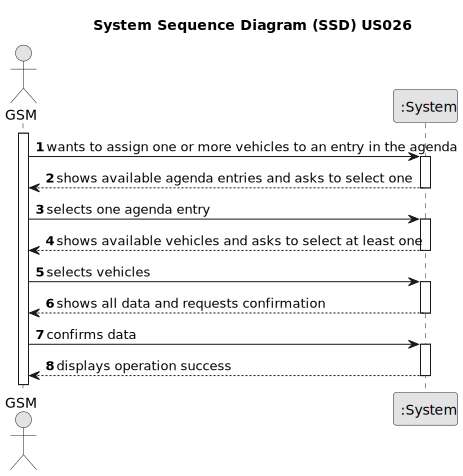

# US026 - As a GSM I want to assign one or more vehicles to an entry in the Agenda.

## 1. Requirements Engineering

### 1.1. User Story Description

As a GSM, I want to assign one or more vehicles to an entry in
the Agenda.

### 1.2. Customer Specifications and Clarifications 

**From the specifications document:**

> Transcribed: _The Agenda is made up of entries that relate to a task (which was previously in the To-Do List), the team that will carry out the task, the vehicles/equipment assigned to the task, expected duration, and the status (Planned, Postponed, Canceled, Done)._

> Justification: To perform certain tasks GSM may assign some vehicle or vehicles.

**From the client clarifications:**

> **Question:** How will the Green Spaces Manager choose the vehicle to assign? By its plate?
>
> **Answer:** The data related with vehicle should be provided in order to ease the selection.

> **Question:** Is the number of vehicles to be assigned provided by the Green Spaces Manager?
>
> **Answer:** There is no specification concerning the number of vehicles, is upt to GSM decide what vehicles the task needs.

> **Question:** What requirements must be met in order for a vehicle to be assigned to an entry?
> 
> **Answer:** The vehicle needs to be available in the period.

> **Question:** Should all vehicles be available to assign to an agenda entry, or only vehicles that are up to date with maintenance?
>
> **Answer:** All vehicles that are not assigned to a task in the same period. In a real context, we would also need to manage (un)availability of vehicles due to revisions or breakdowns, but it is not necessary in this proof-of-concept.

### 1.3. Acceptance Criteria

* **AC1:** The vehicle must be registered in the system.
* **AC2:** The vehicle must be available in order to be assigned to an entry in the Agenda.
* **AC3:** Availability of the vehicles must ignore maintenance conditions.
* **AC4:** The vehicle list must be presented to user with plate, brand, model and current km. 
* **AC5:** The user must be able to add multiple vehicles to the agenda entry. 
* **AC6:** The user must validate the selected data in order to make sure it is correct. 

### 1.4. Found out Dependencies

* There is a dependency on "US06 - As a VFM I wish to register a vehicle" as there must be at least one vehicle to be assigned to the agenda entry. 
* There is a dependency on "US22 - As a GSM, I want to add a new entry in the Agenda." because must exist at least one agenda entry to assign the vehicle.

### 1.5 Input and Output Data

**Input Data:**

* Selected data:
    * Select one agenda entry
    * Select one or multiple Vehicles 

**Output Data:**

* (In)Success of the operation

### 1.6. System Sequence Diagram (SSD)

### 1.7 Other Relevant Remarks

