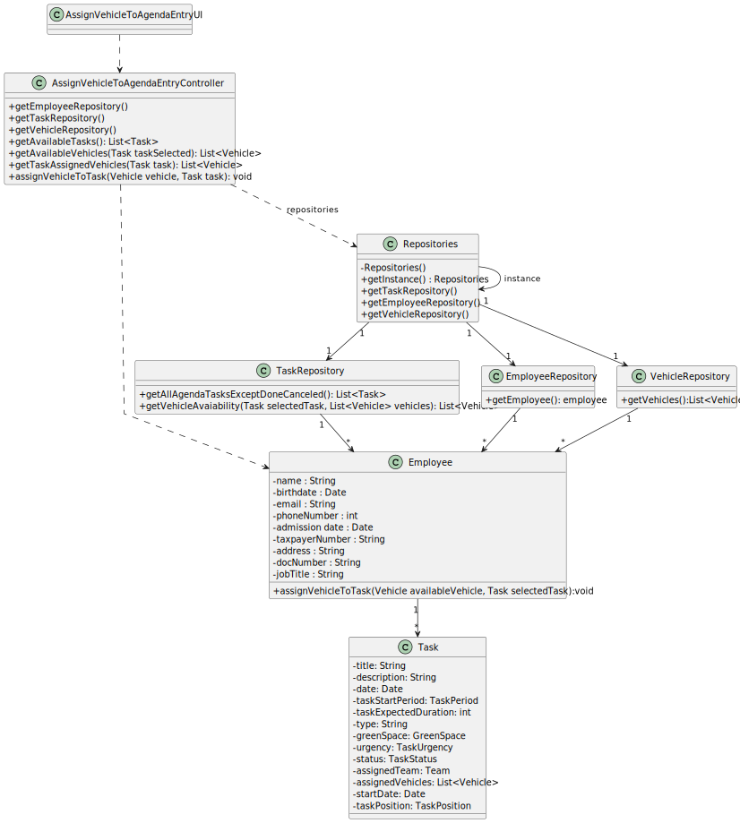

# US026 - As a GSM I want to assign one or more vehicles to an entry in the Agenda.

## 3. Design - User Story Realization 

### 3.1. Rationale

| Interaction ID | Question: Which class is responsible for...   | Answer                               | Justification (with patterns)                                                                                 |
|:-------------  |:----------------------------------------------|:-------------------------------------|:--------------------------------------------------------------------------------------------------------------|
| Step 1  		 | 	... interacting with the actor?              | AssignVehicleToAgendaEntryUI         | Pure Fabrication: there is no reason to assign this responsibility to any existing class in the Domain Model. |
| 			  		 | 	... coordinating the US?                     | AssignVehicleToAgendaEntryController | Controller                                                                                                    |
| 			  		 | ... knowing the user using the system?        | EmployeeRepository                   | IE: knows the GSM                                                                                             |
| Step 2  		 | 	... show available agenda entries?						     | TaskRepository                       | I.E: Knows all entries (tasks).                                                                               |
| Step 3  		 | ...validating selected data?	                 | AssignVehicleToAgendaEntryUI         | Pure Fabrication                                                                                              |
| Step 4  		 | 	...shows available vehicles?                 | VehicleRepository                    | IE: Knows all the vehicles.                                                                                   |
| Step 5  		 | ...validating selected data?	                 | AssignVehicleToAgendaEntryUI         | Pure Fabrication                                                                                              |
| Step 6  		 | 							                                       |                                      |                                                                                                               |              
| Step 7  		 | 	... assign vehicle to agenda entry?          | Employee                             | IE: knows vehicles and tasks                                                                                  |
|   		 | 	... validating all data (local validation)?  | Task                                 | IE: owns its data.                                                                                            | 
| 			  		 | 	... validating all data (global validation)? | Employee                             | IE: knows all agenda entries.                                                                                 | 
| 			  		 | 	... saving the selected data?                | Employee                             | IE: owns all agenda entries.                                                                                  | 
| Step 8  		 | 	... informing operation success?             | AssignVehicleToAgendaEntryUI         | IE: is responsible for user interactions.                                                                     | 

### Systematization ##

According to the taken rationale, the conceptual classes promoted to software classes are: 

* Task
* Employee

Other software classes (i.e. Pure Fabrication) identified: 

* AssignVehicleToAgendaEntryUI  
* AssignVehicleToAgendaEntryController
* EmployeeRepository
* VehicleRepository
* TaskRepository

## 3.2. Sequence Diagram (SD)

### Full Diagram

This diagram shows the full sequence of interactions between the classes involved in the realization of this user story.

## 3.3. Class Diagram (CD)

