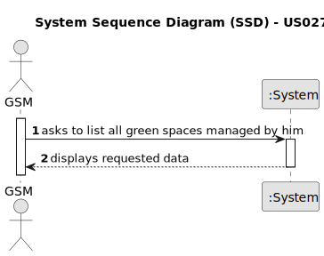

# US027 - As a GSM, I need to list all green spaces managed by me.

## 1. Requirements Engineering

### 1.1. User Story Description

As a GSM, I need to list all green spaces managed by me.

### 1.2. Customer Specifications and Clarifications 

**From the specifications document:**

> Transcribed: _Green Spaces Manager (GSM) - the person responsible for managing the green spaces in charge of the organization._ 

> Justification: The GSM must check if the green spaces under his management have changed. 

>The list of green spaces must be sorted by size in descending order (area in hectares should be used). 

[//]: # (> **Question:** Which is the unit of measurement used to estimate duration?)

[//]: # (>)

[//]: # (> **Answer:** Duration is estimated in days.)

[//]: # ()
[//]: # (> **Question:** Monetary data is expressed in any particular currency?)

[//]: # (>)

[//]: # (> **Answer:** Monetary data &#40;e.g. estimated cost of a task&#41; is indicated in POT &#40;virtual currency internal to the platform&#41;.)

### 1.3. Acceptance Criteria

* **AC1:** The list of green spaces must be sorted by size in descending order (area in hectares should be used). The sorting algorithm to be used by the application must be defined through a configuration file. At least two sorting algorithms should be available.
* **AC2:** The list of green spaces must show the typology of each green space.

### 1.4. Found out Dependencies

* There is a dependency on "US003 - As an HRM, I want to register a collaborator with a job and
  fundamental characteristics" as there must exist at least one GSM that manage the listed Greenspaces.
* There is a dependency on "US020 - As a Green Space Manager (GSM), I want to register a green
  space (garden, medium-sized park or large-sized park) and its respective
  area" because it's where the listed GreenSpaces are created.

### 1.5 Input and Output Data

[//]: # (**Input Data:**)
	
[//]: # (* Selected data:)

[//]: # (    * a employee that is a GSM )

**Output Data:**

* List of parks managed by the GSM

#### Alternative One

### 1.7 Other Relevant Remarks

