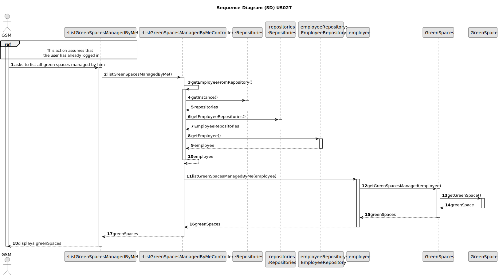
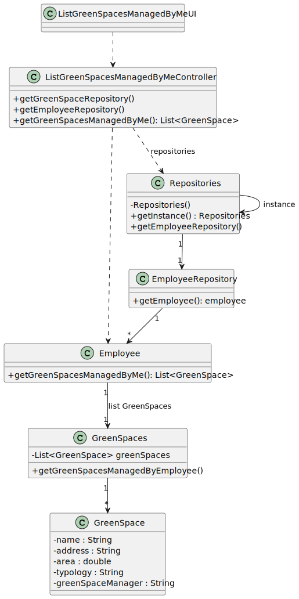

# US027 - As a GSM, I need to list all green spaces managed by me.

## 3. Design - User Story Realization 

### 3.1. Rationale

[//]: # (_**Note that SSD - Alternative One is adopted.**_)

| Interaction ID | Question: Which class is responsible for... | Answer                           | Justification (with patterns)                                                                                 |
|:---------------|:--------------------------------------------|:---------------------------------|:--------------------------------------------------------------------------------------------------------------|
| Step 1  		     | 	... interacting with the actor?            | ListGreenSpacesManagedUI         | Pure Fabrication: there is no reason to assign this responsibility to any existing class in the Domain Model. |
| 			  		        | 	... coordinating the US?                   | ListGreenSpacesManagedController | Controller                                                                                                    |
| 			  		        | ... knowing the user using the system?      | EmployeeRepository               | IE: knows GSM                                                                                                 |
| 			  		        | ... check GreenSpaces managed by this GSM   | Employee                         | IE: Has/knows GSM                                                                                             |
|   		           | 	... knowing the GreenSpaces to show?       | GreenSpacesRepository            | IE: Knows all the GreenSpaces                                                                                 |
| Step 2  		     | 	... displaying list?						                 | ListGreenSpacesManagedUI                                 | IE: is responsible for user interactions.                                                                                                               |

### Systematization ##

According to the taken rationale, the conceptual classes promoted to software classes are: 

* Employee
* Task

Other software classes (i.e. Pure Fabrication) identified: 

* ListGreenSpacesManagedUI  
* ListGreenSpacesManagedController
* EmployeeRepository
* GreenSpacesRepository

## 3.2. Sequence Diagram (SD)

[//]: # (_**Note that SSD - Alternative Two is adopted.**_)

### Full Diagram

This diagram shows the full sequence of interactions between the classes involved in the realization of this user story.

## 3.3. Class Diagram (CD)

