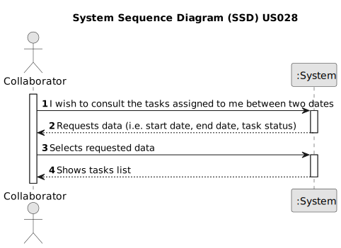

# US028 - As a Collaborator, I wish to consult the tasks assigned to me between two dates

## 1. Requirements Engineering

### 1.1. User Story Description

As a Collaborator, I wish to consult the tasks assigned to me between two dates.

### 1.2. Customer Specifications and Clarifications 

**From the specifications document:**

> Transcribed: The management of green areas for public use requires the timely management and completion of multiple
tasks throughout the year. In the daily management, the GSM uses two essential tools: the Agenda and the Task List
(aka To-Do List). The To-Do List comprises all the tasks required to be done in order to assure the proper functioning
of the parks. 

> Justification: By providing a list of tasks assigned to a Collaborator that can be filtered by date and status, he can
easily consult the daily tasks as well the past and future tasks.

### 1.3. Acceptance Criteria

* **AC1:** The list of tasks must be sorted by date.
* **AC2:** The Collaborator should be able to filter the results by the status of the task.

### 1.4. Found out Dependencies

* There is a dependency on "US003 - As an HRM, I want to register a collaborator with a job and
  fundamental characteristics" as there must be at least one collaborator to list the tasks.
* There is a dependency on "US022 - Add a new entry in the Agenda" as there must be at least one task to the listed.
* There is a dependency on "US023 - Assign a Team to an entry in the Agenda" since tasks should be assigned to a team that has a collaborator.

### 1.5 Input and Output Data

**Input Data:**
	
* Selected data:
    * a start date
    * an end date
    * a task status

**Output Data:**

* List of tasks assigned to the Collaborator

### 1.6. System Sequence Diagram (SSD)

### 1.7 Other Relevant Remarks

n/a
