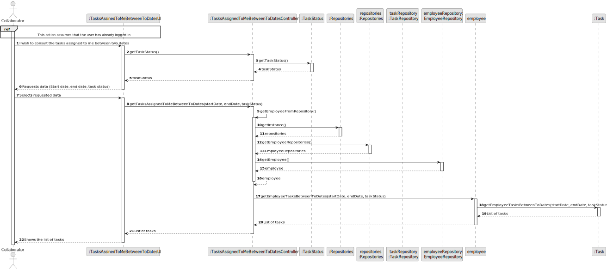
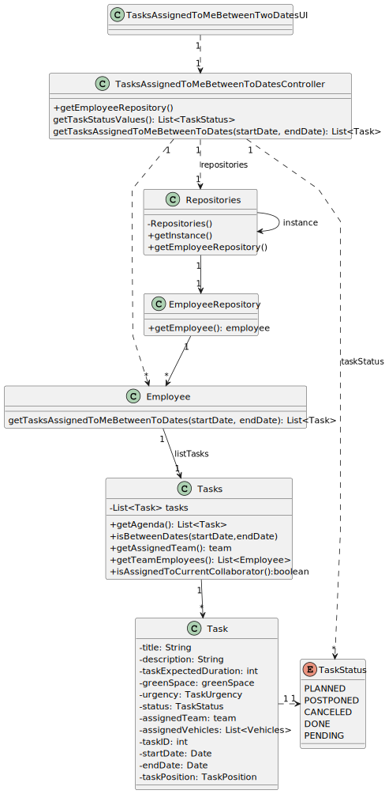

# US028 - As a Collaborator, I wish to consult the tasks assigned to me between two dates

## 3. Design - User Story Realization

### 3.1. Rationale

| Interaction ID  | Question: Which class is responsible for...            | Answer         | Justification (with patterns)                       |
|:----------------|:-------------------------------------------------------|:---------------|:----------------------------------------------------|
| Step 1	         | 	... interacting with the actor?                       | TaskUI         | Pure Fabrication: responsible for user interactions |
|                 | ... coordinating the US?                               | TaskController | Controller                                          |
| Step 2          |                                                        |                |                                                     |
| Step 3          | ... interacting with the actor?                        | TaskUI         | Pure Fabrication                                    |
| Step 4          | ... coordinating the US?                               | TaskController | Controller                                          |
|                 | ... knowing the tasks to be shown?                     | TaskRepository | IE: knows/has its own Tasks                         |
|                 | ... knowing if a task is assigned to the current user? | Task           | IE: stores business logic related to itself         |
|                 | ... knowing all the possible task status?              | TaskStatus     | Enumeration                                         |
|                 | ... show list of tasks?                                | TaskUI         | IE: responsible for user interactions               |

### Systematization ##

According to the taken rationale, the conceptual classes promoted to software classes are:

* Task
* TaskStatus

Other software classes (i.e. Pure Fabrication) identified:

* TaskUI
* TaskController
* TaskRepository

## 3.2. Sequence Diagram (SD)

### Full Diagram

This diagram shows the full sequence of interactions between the classes involved in the realization of this user story.

## 3.3. Class Diagram (CD)

