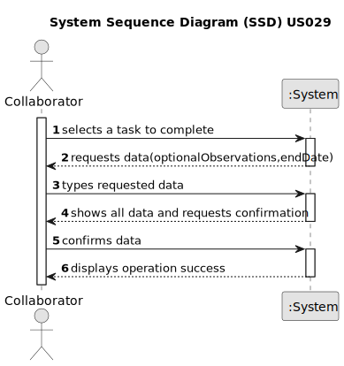

# US029 - Record the completion of a task

## 1. Requirements Engineering

### 1.1. User Story Description

As a Collaborator, I want to record the completion of a task.

### 1.2. Customer Specifications and Clarifications 

**From the specifications document:**

> Transcribed: The management of green areas for public use requires the timely management and completion of multiple
tasks throughout the year. 

> Transcribed: The Agenda is made up of entries that relate to a task (which was previously in the To-Do List), the team
that will carry out the task, the vehicles/equipment assigned to the task, expected duration, and the status (Planned,
Postponed, Canceled, Done). 

**From the client clarifications:**

> **Question:** When a collaborator records a task, it should be asked for any observations regarding the completed task?
>
> **Answer:** Maybe if optional, not mandatory.

### 1.3. Acceptance Criteria

* **AC1:** Task status must not be Canceled or Done.
* **AC2:** Observations must be optional, not mandatory.
* **AC3:** Task must be assigned to the Collaborator.

### 1.4. Found out Dependencies

* There is a dependency on "US022 - Add a new entry in the Agenda" as there must be at least one task to be completed.
* There is a dependency on "US023 - Assign a Team to an entry in the Agenda" since tasks should be assigned before being
completed.
* There is a dependency on "US028 - Consult the tasks assigned to me between two dates" since the actor needs to be able 
to list the tasks in order to complete them.

### 1.5 Input and Output Data

**Input Data:**

* Typed data:
    * optional observations regarding task completion
	
* Selected data:
    * a task 

**Output Data:**

* (In)Success of the operation

### 1.6. System Sequence Diagram (SSD)

### 1.7 Other Relevant Remarks

* The collaborator can only complete tasks assigned to him
