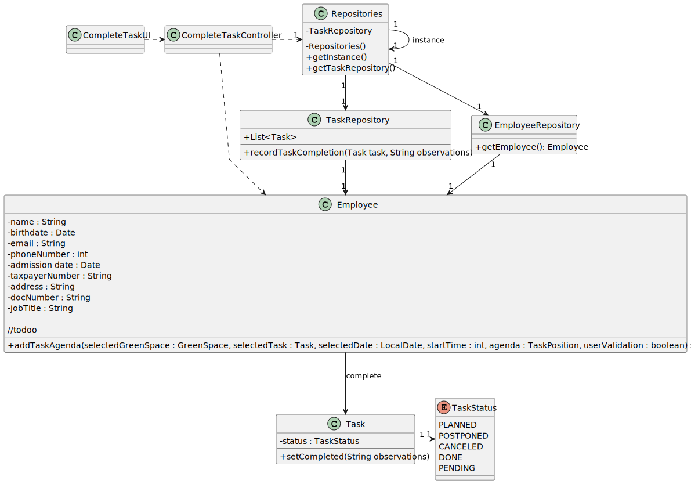

# US029 - As a Collaborator, I want to record the completion of a task.

## 3. Design - User Story Realization

### 3.1. Rationale

| Interaction ID | Question: Which class is responsible for...            | Answer         | Justification (with patterns)                       |
|:---------------|:-------------------------------------------------------|:---------------|:----------------------------------------------------|
| Step 1	        | 	... interacting with the actor?                       | TaskUI         | Pure Fabrication: responsible for user interactions |
| 	              | 	... coordinating the US?                              | TaskController | Controller                                          |
| Step 2         |                                                        |                |                                                     |
| Step 3         | ... interacting with the actor?                        | TaskUI         | Pure Fabrication: responsible for user interactions |
|                | ... coordinating the US?                               | TaskController | Controller                                          |
|                | ... saving inputted data and record completion of task | Task           | IE: owns its own data                               |
| Step 4         | ... interacting with the actor?                        | TaskUI         | Pure Fabrication: responsible for user interactions |
|                | ... knowing the possible task status?                  | TaskStatus     | Enumeration                                         |

### Systematization ##

According to the taken rationale, the conceptual classes promoted to software classes are:

* Task
* TaskStatus

Other software classes (i.e. Pure Fabrication) identified:

* TaskUI
* TaskController

## 3.2. Sequence Diagram (SD)

### Full Diagram

This diagram shows the full sequence of interactions between the classes involved in the realization of this user story.

## 3.3. Class Diagram (CD)

