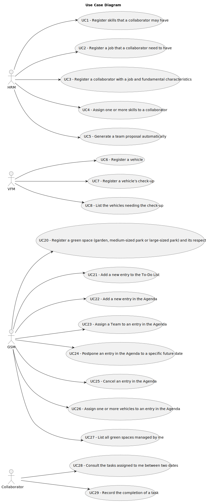

# Use Case Diagram (UCD)

**In the scope of this project, there is a direct relationship of _1 to 1_ between Use Cases (UC) and User Stories (US).**

[//]: # ( However, be aware, this is a pedagogical simplification. On further projects and course units there may also exist _1 to N **and/or** N to 1_ relationships between UC and US.)

[//]: # (**Insert below the Use Case Diagram in a SVG format**)

[//]: # (**For each UC/US, it must be provided evidences of applying main activities of the software development process &#40;requirements, analysis, design, tests and code&#41;. Gather those evidences on a separate file for each UC/US and set up a link as suggested below.**)

# Use Cases / User Stories

| UC/US | Description                                                                                                                                                                       |                   
|:------|:----------------------------------------------------------------------------------------------------------------------------------------------------------------------------------|
| US001 | [Register skills that may be appointed to a collaborator](../../us001/Readme.md)                                                                                                  |
| US002 | [Register a job](../../us002/Readme.md)                                                                                                                                           |
| US003 | [Register a collaborator with a job and fundamental characteristics](../../US003/Readme.md)                                                                                       | 
| US004 | [Assign one or more skills to a collaborator](../../US004/Readme.md)                                                                                                              |
| US005 | [Generate a team proposal automatically](../../us005/Readme.md)                                                                                                                   |
| US006 | [Register a vehicle including Brand, Model, Type, Tare, Gross Weight, Current Km, Register Date, Acquisition Date, Maintenance/Checkup Frequency (in Kms)](../../us006/Readme.md) |
| US007 | [Register a vehicle’s check-up](../../US007/Readme.md)                                                                                                                            |
| US008 | [List the vehicles needing the check-up](../../US008/Readme.md)                                                                                                                   |
| US20  | [Register a green space (garden, medium-sized park or large-sized park) and its respective area](../../us20/Readme.md)                                                            |
| US21  | [Add a new entry to the To-Do List](../../us21/Readme.md)                                                                                                                         |
| US22  | [Add a new entry in the Agenda](../../US022/Readme.md)                                                                                                                             | 
| US23  | [Assign a Team to an entry in the Agenda](../../US023/Readme.md)                                                                                                                   |
| US24  | [Postpone an entry in the Agenda to a specific future date](../../us24/Readme.md)                                                                                                 |
| US25  | [Cancel an entry in the Agenda](../../us25/Readme.md)                                                                                                                             |
| US26  | [Assign one or more vehicles to an entry in the Agenda](../../US026/Readme.md)                                                                                                     |
| US27  | [List all green spaces managed by me](../../US027/Readme.md)                                                                                                                       
| US28  | [Consult the tasks assigned to me between two dates](../../US028/Readme.md)                                                                                                        |
| US29  | [Record the completion of a task](../../US029/Readme.md)                                                                                                                          