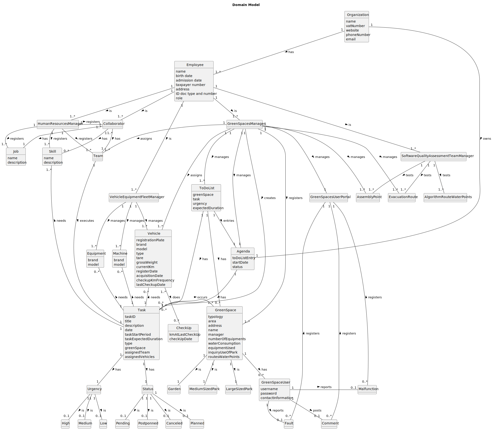

# OO Analysis

[//]: # (The construction process of the domain model is based on the client specifications, especially the nouns (for)
[//]: # (_concepts_ and verbs (for _relations_ used.)

## Rationale to identify domain conceptual classes

[//]: # ( To identify domain conceptual classes, start by making a list of candidate conceptual classes inspired by the list of)
[//]: # (categories suggested in the book "Applying UML and Patterns: An Introduction to Object-Oriented Analysis and Design and
Iterative Development".)

### _Conceptual Class Category List_

[//]: # (**Business Transactions**)

[//]: # ()

[//]: # (* Tasks)

[//]: # ()

[//]: # (---)

[//]: # ()

[//]: # (**Transaction Line Itemss**)

[//]: # ()

[//]: # (* )

[//]: # ()

[//]: # (---)

[//]: # ()

[//]: # (**Product/Service related to a Transaction or Transaction Line Item**)

[//]: # ()

[//]: # (* )

[//]: # ()

[//]: # (---)

[//]: # ()

[//]: # (**Transaction Records**)

[//]: # ()

[//]: # (* )

[//]: # ()

[//]: # (---  )

**Roles of People or Organizations**

* Organization
* Employee

[//]: # (* HumanResourcesManager)

[//]: # (* VehicleEquipmentFleetManager)

[//]: # (* GreenSpacesManager)

[//]: # (* Collaborator)

---

**Places**

* GreenSpace
* Garden
* Medium-sized park
* Large-sized park

---

**Noteworthy Events**

* Agenda
* Task

---

**Physical Objects**

* Vehicle
* Machine
* Equipment

---

**Descriptions of Things**

* GreenSpaces: Garden, Medium-sized park or Large-sized park
* Vehicle: passengers or mixed, light or heavy, open box or closed vans or tucks...
* Machine: tractor, backhoe loader and rotating machine or lawnmower...
* Equipment: lifting platform, chainsaw, brush cutter, blower, ladder or cistern...
* Employee: HumanResourcesManager, VehicleEquipmentFleetManager, GreenSpacesManager, Collaborator, SoftwareQualityAssessmentTeamManager

---

**Catalogs**

*

---

**Containers**

* Team

---

**Elements of Containers**
* Collaborator

---

**Organizations**

* Organization

---

**Other External/Collaborating Systems**

* GreenSpacesUserPortal
* GreenSpaceUser

---

[//]: # ()

[//]: # (**Records of finance, work, contracts, legal matters**)

[//]: # ()

[//]: # (* )

[//]: # ()

[//]: # (---)

[//]: # ()

[//]: # (**Financial Instruments**)

[//]: # ()

[//]: # (* )

[//]: # ()

[//]: # (---)

[//]: # ()

[//]: # (**Documents mentioned/used to perform some work/**)

[//]: # ()

[//]: # (* )

[//]: # ()

[//]: # (---)

## Rationale to identify associations between conceptual classes

[//]: # (An association is a relationship between instances of objects that indicates a relevant connection and that is worth of)
[//]: # (remembering, or it is derivable from the List of Common Associations:)

[//]: # ( - **_A_** is physically or logically part of **_B_**)
[//]: # ( - **_A_** is physically or logically contained in/on **_B_**)
[//]: # ( - **_A_** is a description for **_B_**)
[//]: # ( - **_A_** known/logged/recorded/reported/captured in **_B_**)
[//]: # ( - **_A_** uses or manages or owns **_B_**)
[//]: # ( - **_A_** is related with a transaction (item of **_B_**)
[//]: # ( - etc.)

| Concept (A) 		                              |   Association   	   |                          Concept (B) |
|---------------------------------------------|:-------------------:|-------------------------------------:|
| Organization                                |    owns    		 	     |                               Agenda |
| Organization                                |    has    		  	     |                             Employee |
| Employee                                    |     is    		 	      |                HumanResourcesManager |
| Employee                                    |     is    		 	      |         VehicleEquipmentFleetManager |
| Employee                                    |     is    		 	      |                   GreenSpacesManager |
| Employee	                                   |      is   		 	      |                         Collaborator |
| Employee	                                   |      is   		 	      | SoftwareQualityAssessmentTeamManager |
| Task                                        |   occurs     		 	   |                           GreenSpace |
| HumanResourcesManager                       | registers      		 	 |                                 Team |
| HumanResourcesManager                       | registers      		 	 |                         Collaborator |
| HumanResourcesManager                       | registers      		 	 |                                  Job |
| HumanResourcesManager                       | registers      		 	 |                                Skill |
| VehicleEquipmentFleetManager                |   manages    		 	   |                              Vehicle |
| VehicleEquipmentFleetManager                |   manages    		 	   |                            Equipment |
| VehicleEquipmentFleetManager                |   manages    		 	   |                              Machine |
| GreenSpacesManager                          |   manages    		 	   |                           GreenSpace |
| GreenSpacesManager                          |   manages    		 	   |                        AssemblyPoint |
| GreenSpacesManager                          |   manages    		 	   |                      EvacuationRoute |
| GreenSpacesManager                          |    creates  		 	    |                                 Task |
| GreenSpacesManager                          |   manages    		 	   |                GreenSpacesUserPortal |
| SoftwareQualityAssessmentTeamManager        |    tests    		 	    |            AlgorithmRouteWaterPoints |
| SoftwareQualityAssessmentTeamManager        |    tests    		 	    |                        AssemblyPoint |
| SoftwareQualityAssessmentTeamManager        |    tests    		 	    |                      EvacuationRoute |
| Collaborator                                |    has    		  	     |                                  Job |
| Collaborator                                |    has    		   	    |                                SKill |
| Collaborator                                |    has    		  	     |                                 Team |
| Task                                        |    needs   		  	    |                                Skill |
| Comment                                     |  registers   		 	   |                GreenSpacesUserPortal |
| Malfunction                                 |  registers   		 	   |                GreenSpacesUserPortal |
| Fault                                       |  registers   		 	   |                GreenSpacesUserPortal |
| GreenSpaceUser                              |   posts     		 	    |                              Comment |
| GreenSpaceUser                              |  reports     		 	   |                          Malfunction |
| GreenSpaceUser                              |  reports     		 	   |                                Fault |
| Agenda                                      |    has     		 	     |                                 Task |
| Team                                        |  executes     		 	  |                                 Task |
| GreenSpace                                  |    has     		 	     |                       GreenSpaceUser |
| GreenSpace                                  |     is     		 	     |                               Garden |
| GreenSpace                                  |    is       		 	    |                    Medium-sized park |
| GreenSpace                                  |    is       		 	    |                     Large-sized park |
| Task	                                       |  needs       		 	   |                              Vehicle |
| Task	                                       |    needs   		 	     |                              Machine |
| Task	                                       |    needs    		 	    |                            Equipment |

## Domain Model

[//]: # ( **Do NOT forget to identify concept atributes too.**)

[//]: # ( **Insert below the Domain Model Diagram in a SVG format**)

