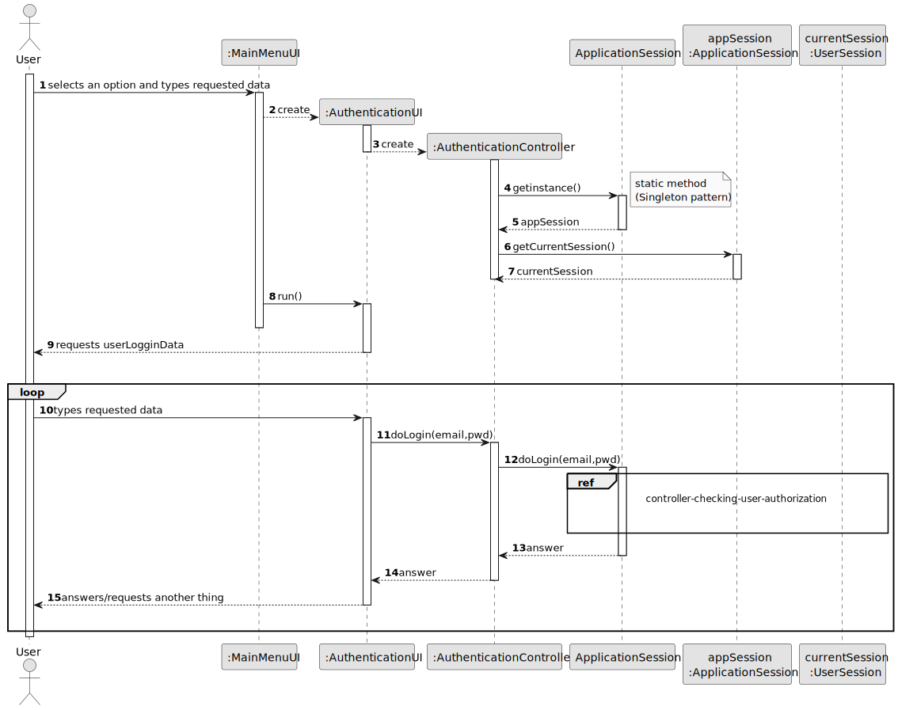
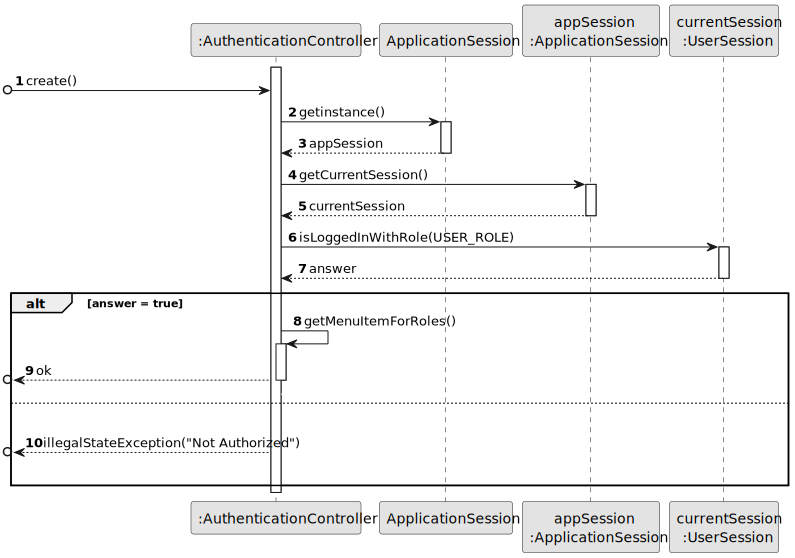
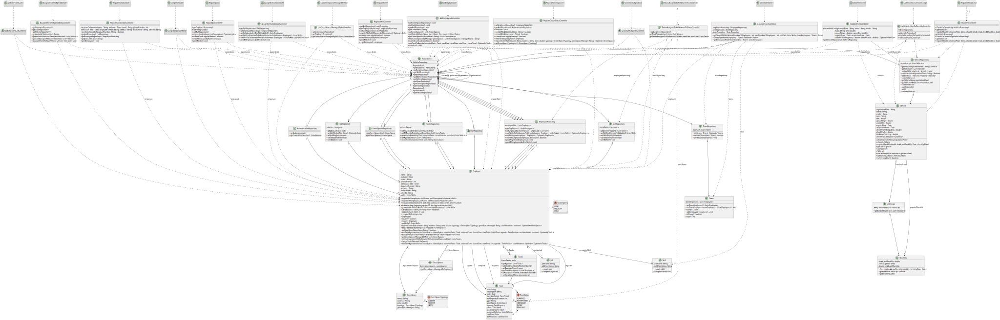

# OO Design

### Application Overview

The following sequence diagram graphically represents the intended flow for the application where there is a clear separation (decoupling) between the domain classes and the user interaction classes (_user interface_). This decoupling is performed by classes with the suffix _Controller_.

#### OBS:
- **_{MenuX}UI_ :** represents an instance of a UI class that presents several menu options and/or features to the user
- **_{NameOfUC}UI_ :** represents an instance of a specific UI class for the realization of a given use case / user story
- **_{NameOfUC}Controller_ :** represents an instance of a Controller class responsible for decoupling the UI from the Domain classes
- **_methodX(...)_ :** abstraction representing the invocation a public method of {NameOfUC} Controller
- **_methodY(...)_ :** abstraction representing the invocation a public method of any class belonging to the domain
- In the remaining sequence diagrams, focus only focus on the content of the **_loop_**

The execution of some functionalities by users must be preceded and verified by an authorization mechanism based on users' roles.
This verification can be carried out as follows:

Users' authentication and authorization processes are reutilizing an external component called **_AuthLib_**.
Documentation regarding this component is available [here](../../../auth/Readme.md).

## Class Diagram

